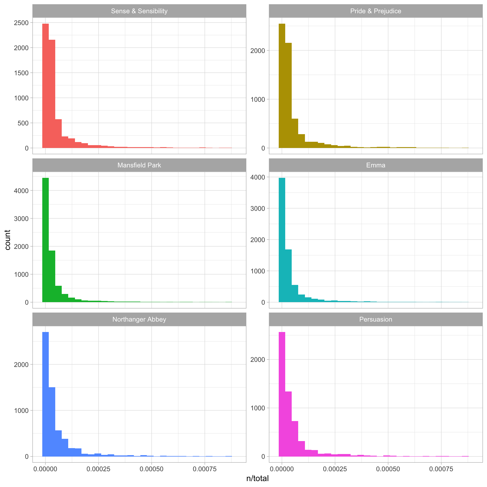
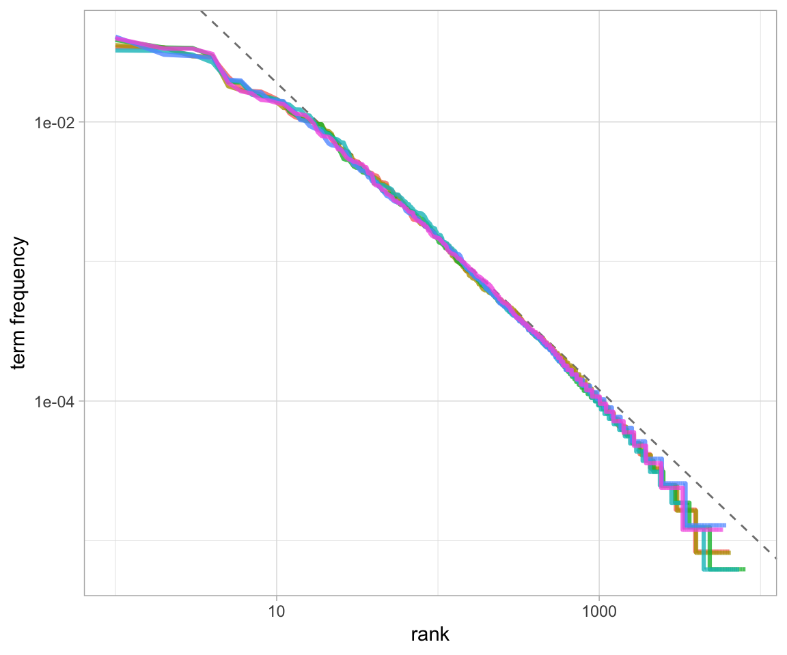
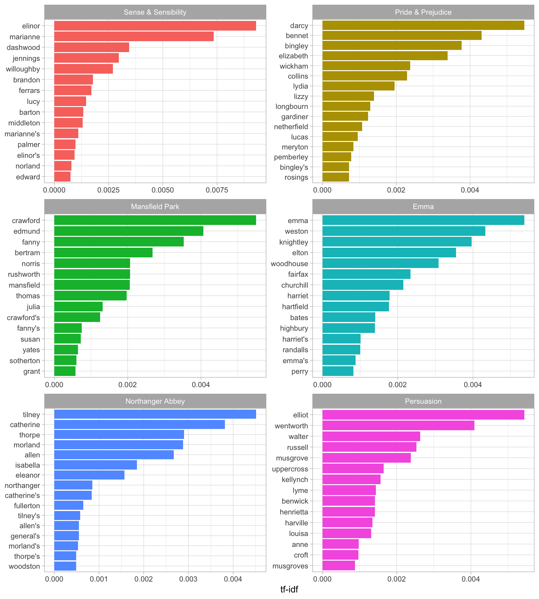
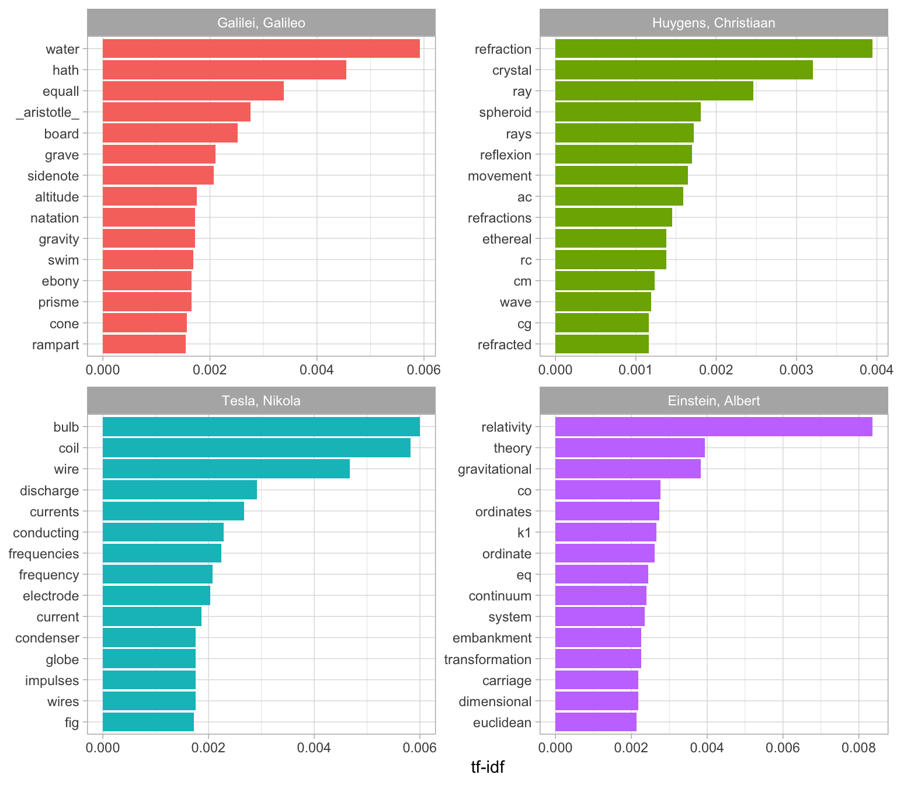
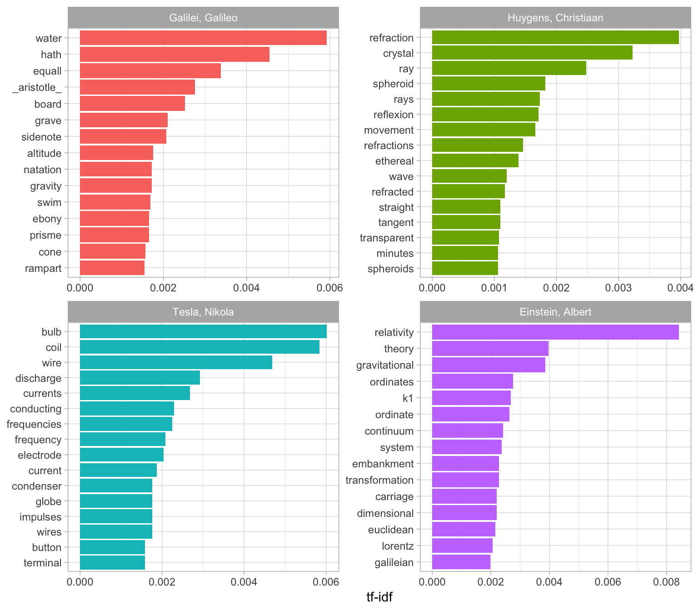

3 Analyzing word and document frequency: tf-idf
===============================================

A central question in text mining and natural language processing is how to quantify what a document is about. Can we do this by looking at the words that make up the document? One measure of how important a word may be is its *term frequency* (tf), how frequently a word occurs in a document, as we examined in Chapter 1. There are words in a document, however, that occur many times but may not be important; in English, these are probably words like "the", "is", "of", and so forth. We might take the approach of adding words like these to a list of stop words and removing them before analysis, but it is possible that some of these words might be more important in some documents than others. A list of stop words is not a very sophisticated approach to adjusting term frequency for commonly used words.

Another approach is to look at a term's *inverse document frequency* (idf), which decreases the weight for commonly used words and increases the weight for words that are not used very much in a collection of documents. This can be combined with term frequency to calculate a term's *tf-idf* (the two quantities multiplied together), the frequency of a term adjusted for how rarely it is used.

> The statistic **tf-idf** is intended to measure how important a word is to a document in a collection (or corpus) of documents, for example, to one novel in a collection of novels or to one website in a collection of websites.

It is a rule-of-thumb or heuristic quantity; while it has proved useful in text mining, search engines, etc., its theoretical foundations are considered less than firm by information theory experts. The inverse document frequency for any given term is defined as

$$idf(\\text{term}) = \\ln{\\left(\\frac{n\_{\\text{documents}}}{n\_{\\text{documents containing term}}}\\right)}$$

We can use tidy data principles, as described in Chapter 1, to approach tf-idf analysis and use consistent, effective tools to quantify how important various terms are in a document that is part of a collection.

3.1 Term frequency in Jane Austen's novels
------------------------------------------

Let's start by looking at the published novels of Jane Austen and examine first term frequency, then tf-idf. We can start just by using dplyr verbs such as `group_by()` and `join()`. What are the most commonly used words in Jane Austen's novels? (Let's also calculate the total words in each novel here, for later use.)

``` r
library(dplyr)
library(janeaustenr)
library(tidytext)

book_words <- austen_books() %>%
  unnest_tokens(word, text) %>%
  count(book, word, sort = TRUE) %>%
  ungroup()

total_words <- book_words %>% 
  group_by(book) %>% 
  summarize(total = sum(n))  # or summarise()

book_words <- left_join(book_words, total_words)

book_words
```

    ## # A tibble: 40,379 x 4
    ##    book              word      n  total
    ##    <fct>             <chr> <int>  <int>
    ##  1 Mansfield Park    the    6206 160460
    ##  2 Mansfield Park    to     5475 160460
    ##  3 Mansfield Park    and    5438 160460
    ##  4 Emma              to     5239 160996
    ##  5 Emma              the    5201 160996
    ##  6 Emma              and    4896 160996
    ##  7 Mansfield Park    of     4778 160460
    ##  8 Pride & Prejudice the    4331 122204
    ##  9 Emma              of     4291 160996
    ## 10 Pride & Prejudice to     4162 122204
    ## # ... with 40,369 more rows

There is one row in this `book_words` data frame for each word-book combination; `n` is the number of times that word is used in that book and `total` is the total words in that book. The usual suspects are here with the highest `n`, "the", "and", "to", and so forth. In Figure 3.1, let's look at the distribution of `n/total` for each novel, the number of times a word appears in a novel divided by the total number of terms (words) in that novel. This is exactly what term frequency is.

``` r
#library(ggplot2)

ggplot(book_words, aes(n/total, fill = book)) +
  geom_histogram(show.legend = FALSE) +
  xlim(NA, 0.0009) +
  facet_wrap(~book, ncol = 2, scales = "free_y")
```



(Figure 3.1: Term Frequency Distribution in Jane Austen's Novels)

There are very long tails to the right for these novels (those extremely common words!) that we have not shown in these plots. These plots exhibit similar distributions for all the novels, with many words that occur rarely and fewer words that occur frequently.

3.2 Zipf's law
--------------

Distributions like those shown in Figure 3.1 are typical in language. In fact, those types of long-tailed distributions are so common in any given corpus of natural language (like a book, or a lot of text from a website, or spoken words) that the relationship between the frequency that a word is used and its rank has been the subject of study; a classic version of this relationship is called Zipf's law, after George Zipf, a 20th century American linguist.

> Zipf's law states that the frequency that a word appears is inversely proportional to its rank.

Since we have the data frame we used to plot term frequency, we can examine Zipf's law for Jane Austen's novels with just a few lines of dplyr functions.

``` r
freq_by_rank <- book_words %>%
  group_by(book) %>%
  mutate(rank = row_number(),
         `term frequency` = n/total)

freq_by_rank
```

    ## # A tibble: 40,379 x 6
    ## # Groups:   book [6]
    ##    book              word      n  total  rank `term frequency`
    ##    <fct>             <chr> <int>  <int> <int>            <dbl>
    ##  1 Mansfield Park    the    6206 160460     1           0.0387
    ##  2 Mansfield Park    to     5475 160460     2           0.0341
    ##  3 Mansfield Park    and    5438 160460     3           0.0339
    ##  4 Emma              to     5239 160996     1           0.0325
    ##  5 Emma              the    5201 160996     2           0.0323
    ##  6 Emma              and    4896 160996     3           0.0304
    ##  7 Mansfield Park    of     4778 160460     4           0.0298
    ##  8 Pride & Prejudice the    4331 122204     1           0.0354
    ##  9 Emma              of     4291 160996     4           0.0267
    ## 10 Pride & Prejudice to     4162 122204     2           0.0341
    ## # ... with 40,369 more rows

The `rank` column here tells us the rank of each word within the frequency table; the table was already ordered by `n` so we could use `row_number()` to find the rank. Then, we can calculate the term frequency in the same way we did before. Zipf's law is often visualized by plotting rank on the x-axis and term frequency on the y-axis, on logarithmic scales. Plotting this way, an inversely proportional relationship will have a constant, negative slope.

``` r
freq_by_rank %>%
  ggplot(aes(rank, `term frequency`, color = book)) +
  geom_line(size = 1.1, alpha = 0.8, show.legend = FALSE) +
  scale_x_log10() +
  scale_y_log10()
```


(Figure 3.2: Zipf's law for Jane Austen's novels)

Notice that Figure 3.2 is in log-log coordinates. We see that all six of Jane Austen's novels are similar to each other, and that the relationship between rank and frequency does have negative slope. It is not quite constant, though; perhaps we could view this as a broken [power law](https://en.wikipedia.org/wiki/Power_law) with, say, three sections. Let's see what the exponent of the power law is for the middle section of the rank range.

``` r
rank_subset <- freq_by_rank %>%
  filter(rank < 500,
         rank > 10)

lm(log10(`term frequency`) ~ log10(rank), data = rank_subset)
```

    ## 
    ## Call:
    ## lm(formula = log10(`term frequency`) ~ log10(rank), data = rank_subset)
    ## 
    ## Coefficients:
    ## (Intercept)  log10(rank)  
    ##     -0.6226      -1.1125

Classic versions of Zipf's law have

$$\\text{frequency} \\propto \\frac{1}{\\text{rank}}$$
 and we have in fact gotten a slope close to -1 here. Let's plot this fitted power law with the data in Figure 3.3 to see how it looks.

``` r
freq_by_rank %>%
  ggplot(aes(rank, `term frequency`, color = book)) +
  geom_abline(intercept = -0.62, slope = -1.1, color = "gray50", linetype = 2) +
  geom_line(size = 1.1, alpha = 0.8, show.legend = FALSE) +
  scale_x_log10() +
  scale_y_log10()
```



(Figure 3.3: Fitting an exponent for Zipf's law with Jane Austen's novels)

We have found a result close to the classic version of Zipf's law for the corpus of Jane Austen's novels. The deviations we see here at high rank are not uncommon for many kinds of language; a corpus of language often contains fewer rare words than predicted by a single power law. The deviations at low rank are more unusual. Jane Austen uses a lower percentage of the most common words than many collections of language. This kind of analysis could be extended to compare authors, or to compare any other collections of text; it can be implemented simply using tidy data principles.

3.3 The `bind_tf_idf` function
------------------------------

The idea of tf-idf is to find the important words for the content of each document by decreasing the weight for commonly used words and increasing the weight for words that are not used very much in a collection or corpus of documents, in this case, the group of Jane Austen's novels as a whole. Calculating tf-idf attempts to find the words that are important (i.e., common) in a text, but not *too* common. Let's do that now.

The `bind_tf_idf` function in the tidytext package takes a tidy text dataset as input with one row per token (term), per document. One column (`word` here) contains the terms/tokens, one column contains the documents (`book` in this case), and the last necessary column contains the counts, how many times each document contains each term (`n` in this example). We calculated a `total` for each book for our explorations in previous sections, but it is not necessary for the `bind_tf_idf` function; the table only needs to contain all the words in each document.

``` r
book_words <- book_words %>%
  bind_tf_idf(word, book, n)

book_words
```

    ## # A tibble: 40,379 x 7
    ##    book              word      n  total     tf   idf tf_idf
    ##    <fct>             <chr> <int>  <int>  <dbl> <dbl>  <dbl>
    ##  1 Mansfield Park    the    6206 160460 0.0387     0      0
    ##  2 Mansfield Park    to     5475 160460 0.0341     0      0
    ##  3 Mansfield Park    and    5438 160460 0.0339     0      0
    ##  4 Emma              to     5239 160996 0.0325     0      0
    ##  5 Emma              the    5201 160996 0.0323     0      0
    ##  6 Emma              and    4896 160996 0.0304     0      0
    ##  7 Mansfield Park    of     4778 160460 0.0298     0      0
    ##  8 Pride & Prejudice the    4331 122204 0.0354     0      0
    ##  9 Emma              of     4291 160996 0.0267     0      0
    ## 10 Pride & Prejudice to     4162 122204 0.0341     0      0
    ## # ... with 40,369 more rows

Notice that idf and thus tf-idf are zero for these extremely common words. These are all words that appear in all six of Jane Austen's novels, so the idf term (which will then be the natural log of 1) is zero. The inverse document frequency (and thus tf-idf) is very low (near zero) for words that occur in many of the documents in a collection; this is how this approach decreases the weight for common words. The inverse document frequency will be a higher number for words that occur in fewer of the documents in the collection.

Let's look at terms with high tf-idf in Jane Austen's works.

``` r
book_words %>%
  select(-total) %>%
  arrange(desc(tf_idf))
```

    ## # A tibble: 40,379 x 6
    ##    book                word          n      tf   idf  tf_idf
    ##    <fct>               <chr>     <int>   <dbl> <dbl>   <dbl>
    ##  1 Sense & Sensibility elinor      623 0.00519  1.79 0.00931
    ##  2 Sense & Sensibility marianne    492 0.00410  1.79 0.00735
    ##  3 Mansfield Park      crawford    493 0.00307  1.79 0.00551
    ##  4 Pride & Prejudice   darcy       373 0.00305  1.79 0.00547
    ##  5 Persuasion          elliot      254 0.00304  1.79 0.00544
    ##  6 Emma                emma        786 0.00488  1.10 0.00536
    ##  7 Northanger Abbey    tilney      196 0.00252  1.79 0.00452
    ##  8 Emma                weston      389 0.00242  1.79 0.00433
    ##  9 Pride & Prejudice   bennet      294 0.00241  1.79 0.00431
    ## 10 Persuasion          wentworth   191 0.00228  1.79 0.00409
    ## # ... with 40,369 more rows

Here we see all proper nouns, names that are in fact important in these novels. None of them occur in all of novels, and they are important, characteristic words for each text within the corpus of Jane Austen's novels.

> Some of the values for idf are the same for different terms because there are 6 documents in this corpus and we are seeing the numerical value for ln(6/1), ln(6/2), etc.

Let's look at a visualization for these high tf-idf words in Figure 3.4.

``` r
book_words %>%
  arrange(desc(tf_idf)) %>%
  mutate(word = factor(word, levels = rev(unique(word)))) %>%
  group_by(book) %>%                  # rev: reverse
  top_n(15) %>%
  ungroup %>%
  ggplot(aes(word, tf_idf, fill = book)) +
  geom_col(show.legend = FALSE) +
  labs(x = NULL, y = "tf-idf") +
  facet_wrap(~book, ncol = 2, scales = "free") +
  coord_flip()
```



(Figure 3.4: Highest tf-idf words in each of Jane Austen's Novels)

Still all proper nouns in Figure 3.4! These words are, as measured by tf-idf, the most important to each novel and most readers would likely agree. What measuring tf-idf has done here is show us that Jane Austen used similar language across her six novels, and what distinguishes one novel from the rest within the collection of her works are the proper nouns, the names of people and places. This is the point of tf-idf; it identifies words that are important to one document within a collection of documents.

3.4 A corpus of physics texts
-----------------------------

Let's work with another corpus of documents, to see what terms are important in a different set of works. In fact, let's leave the world of fiction and narrative entirely. Let's download some classic physics texts from Project Gutenberg and see what terms are important in these works, as measured by tf-idf. Let's download [*Discourse on Floating Bodies* by Galileo Galilei](http://www.gutenberg.org/ebooks/37729), [*Treatise on Light* by Christiaan Huygens](http://www.gutenberg.org/ebooks/14725), [*Experiments with Alternate Currents of High Potential and High Frequency* by Nikola Tesla](http://www.gutenberg.org/ebooks/13476), and [*Relativity: The Special and General Theory* by Albert Einstein](http://www.gutenberg.org/ebooks/5001).

This is a pretty diverse bunch. They may all be physics classics, but they were written across a 300-year timespan, and some of them were first written in other languages and then translated to English. Perfectly homogeneous these are not, but that doesn't stop this from being an interesting exercise!

``` r
library(gutenbergr)

physics <- gutenberg_download(
             c(37729, 14725, 13476, 5001),
             meta_fields = "author")
```

Now that we have the texts, let's use `unnest_tokens()` and `count()` to find out how many times each word was used in each text.

``` r
physics_words <- physics %>%
  unnest_tokens(word, text) %>%
  count(author, word, sort = TRUE) #%>%
  #ungroup()

physics_words
```

    ## # A tibble: 12,592 x 3
    ##    author              word      n
    ##    <chr>               <chr> <int>
    ##  1 Galilei, Galileo    the    3760
    ##  2 Tesla, Nikola       the    3604
    ##  3 Huygens, Christiaan the    3553
    ##  4 Einstein, Albert    the    2994
    ##  5 Galilei, Galileo    of     2049
    ##  6 Einstein, Albert    of     2030
    ##  7 Tesla, Nikola       of     1737
    ##  8 Huygens, Christiaan of     1708
    ##  9 Huygens, Christiaan to     1207
    ## 10 Tesla, Nikola       a      1176
    ## # ... with 12,582 more rows

Here we see just the raw counts; we need to remember that these documents are all different lengths. Let's go ahead and calculate tf-idf, then visualize the high tf-idf words in Figure 3.5.

``` r
plot_physics <- physics_words %>%
  bind_tf_idf(word, author, n) %>%
  arrange(desc(tf_idf)) %>%
  mutate(word = factor(word, levels = rev(unique(word)))) %>%
  mutate(author = factor(author, levels =
    c("Galilei, Galileo", "Huygens, Christiaan", "Tesla, Nikola", "Einstein, Albert")
  ))

plot_physics %>%
  group_by(author) %>%
  top_n(15, tf_idf) %>%
  ungroup() %>%
  mutate(word = reorder(word, tf_idf)) %>%
  ggplot(aes(word, tf_idf, fill = author)) +
  geom_col(show.legend = FALSE) +
  labs(x = NULL, y = "tf-idf") +
  facet_wrap(~author, ncol = 2, scales = "free") +
  coord_flip()
```



(Figure 3.5: Highest tf-idf words in each physics texts)

Very interesting indeed. One thing we see here is "eq" in the Einstein text?!

``` r
library(stringr)

physics %>%
  filter(str_detect(text, "eq\\.")) %>%
  select(text)
```

    ## # A tibble: 55 x 1
    ##    text                                                           
    ##    <chr>                                                          
    ##  1 "                         eq. 1: file eq01.gif"                
    ##  2 "                         eq. 2: file eq02.gif"                
    ##  3 "                         eq. 3: file eq03.gif"                
    ##  4 "                         eq. 4: file eq04.gif"                
    ##  5 "                       eq. 05a: file eq05a.gif"               
    ##  6 "                       eq. 05b: file eq05b.gif"               
    ##  7 the distance between the points being eq. 06 .                 
    ##  8 direction of its length with a velocity v is eq. 06 of a metre.
    ##  9 velocity v=c we should have eq. 06a ,                          
    ## 10 the rod as judged from K1 would have been eq. 06 ;             
    ## # ... with 45 more rows

Some cleaning up of the text may be in order. "K1" is the name of a coordinate system for Einstein:

``` r
physics %>%
  filter(str_detect(text, "K1")) %>%
  select(text)
```

    ## # A tibble: 59 x 1
    ##    text                                                                  
    ##    <chr>                                                                 
    ##  1 to a second co-ordinate system K1 provided that the latter is         
    ##  2 condition of uniform motion of translation. Relative to K1 the        
    ##  3 tenet thus: If, relative to K, K1 is a uniformly moving co-ordinate   
    ##  4 with respect to K1 according to exactly the same general laws as with 
    ##  5 does not hold, then the Galileian co-ordinate systems K, K1, K2, etc.,
    ##  6 Relative to K1, the same event would be fixed in respect of space and 
    ##  7 to K1, when the magnitudes x, y, z, t, of the same event with respect 
    ##  8 of light (and of course for every ray) with respect to K and K1. For  
    ##  9 reference-body K and for the reference-body K1. A light-signal is sent
    ## 10 immediately follows. If referred to the system K1, the propagation of 
    ## # ... with 49 more rows

Maybe it makes sense to keep this one. Also notice that in this line we have "co-ordinate", which explains why there are separate "co" and "ordinate" items in the high tf-idf words for the Einstein text; the `unnest_tokens()` function separates around punctuation. Notice that the tf-idf scores for "co" and "ordinate" are close to same!

"AB", "RC", and so forth are names of rays, circles, angles, and so forth for Huygens.

``` r
physics %>% 
  filter(str_detect(text, "AK")) %>% 
  select(text)
```

    ## # A tibble: 34 x 1
    ##    text                                                                  
    ##    <chr>                                                                 
    ##  1 Now let us assume that the ray has come from A to C along AK, KC; the 
    ##  2 be equal to the time along KMN. But the time along AK is longer than  
    ##  3 that along AL: hence the time along AKN is longer than that along ABC.
    ##  4 And KC being longer than KN, the time along AKC will exceed, by as    
    ##  5 line which is comprised between the perpendiculars AK, BL. Then it    
    ##  6 ordinary refraction. Now it appears that AK and BL dip down toward the
    ##  7 side where the air is less easy to penetrate: for AK being longer than
    ##  8 than do AK, BL. And this suffices to show that the ray will continue  
    ##  9 surface AB at the points AK_k_B. Then instead of the hemispherical    
    ## 10 along AL, LB, and along AK, KB, are always represented by the line AH,
    ## # ... with 24 more rows

Let's remove some of these less meaningful words to make a better, more meaningful plot. Notice that we make a custom list of stop words and use `anti_join()` to remove them; this is a flexible approach that can be used in many situations. We will need to go back a few steps since we are removing words from the tidy data frame.

``` r
mystopwords <- data_frame(word = c("eq", "co", "rc", "ac", "ak", "bn",
                                   "fig", "file", "cg", "cb", "cm"))
physics_words <- anti_join(physics_words, mystopwords, by = "word")
plot_physics <- physics_words %>%
  bind_tf_idf(word, author, n) %>%
  arrange(desc(tf_idf)) %>%
  mutate(word = factor(word, levels = rev(unique(word)))) %>%
  group_by(author) %>%
  top_n(15, tf_idf) %>%
  ungroup %>%
  mutate(author = factor(author, levels =
    c("Galilei, Galileo", "Huygens, Christiaan", "Tesla, Nikola", "Einstein, Albert")
  ))

ggplot(plot_physics, aes(word, tf_idf, fill = author)) +
  geom_col(show.legend = FALSE) +
  labs(x = NULL, y = "tf-idf") +
  facet_wrap(~author, ncol = 2, scales = "free") +
  coord_flip()
```



(Figure 3.6: Highest tf-idf words in classic physics texts)

One thing we can conclude from Figure 3.6 is that we don't hear enough about ramparts or things being ethereal in physics today.

3.5 Summary
-----------

Using term frequency and inverse document frequency allows us to find words that are characteristic for one document within a collection of documents, whether that document is a novel or physics text or webpage. Exploring term frequency on its own can give us insight into how language is used in a collection of natural language, and dplyr verbs like `count()` and `rank()` give us tools to reason about term frequency. The tidytext package uses an implementation of tf-idf consistent with tidy data principles that enables us to see how different words are important in documents within a collection or corpus of documents.
