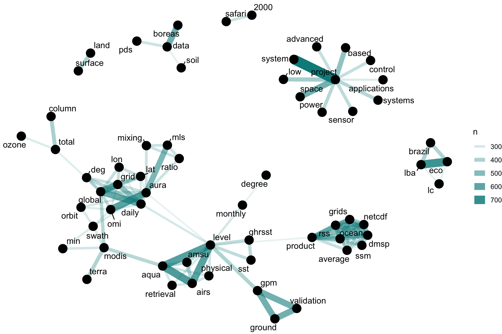
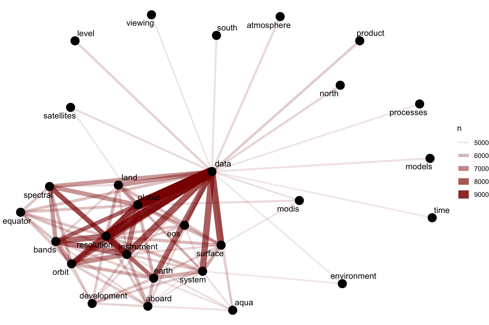
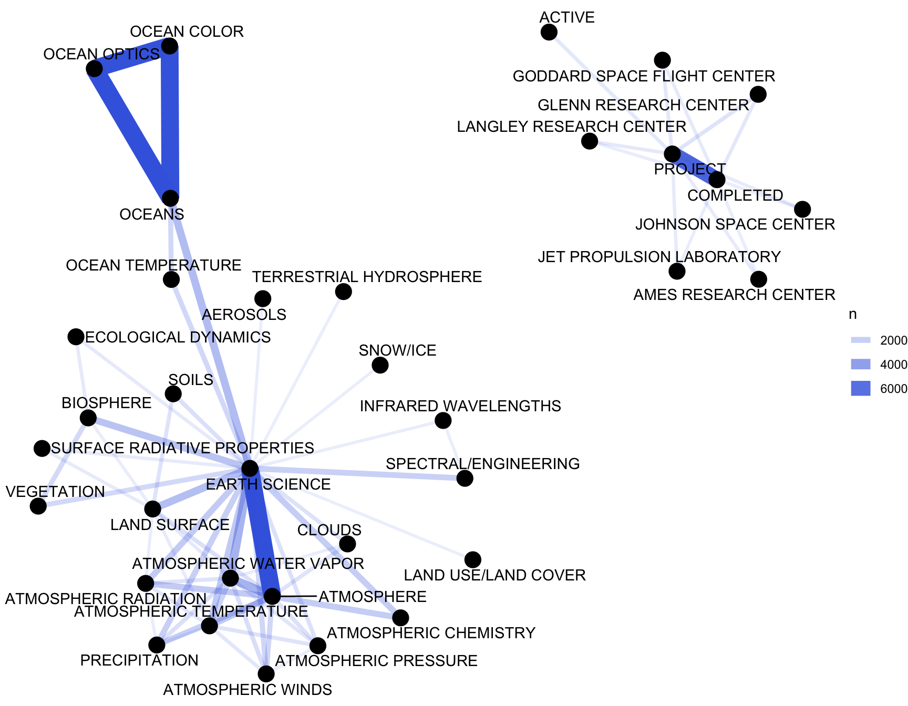
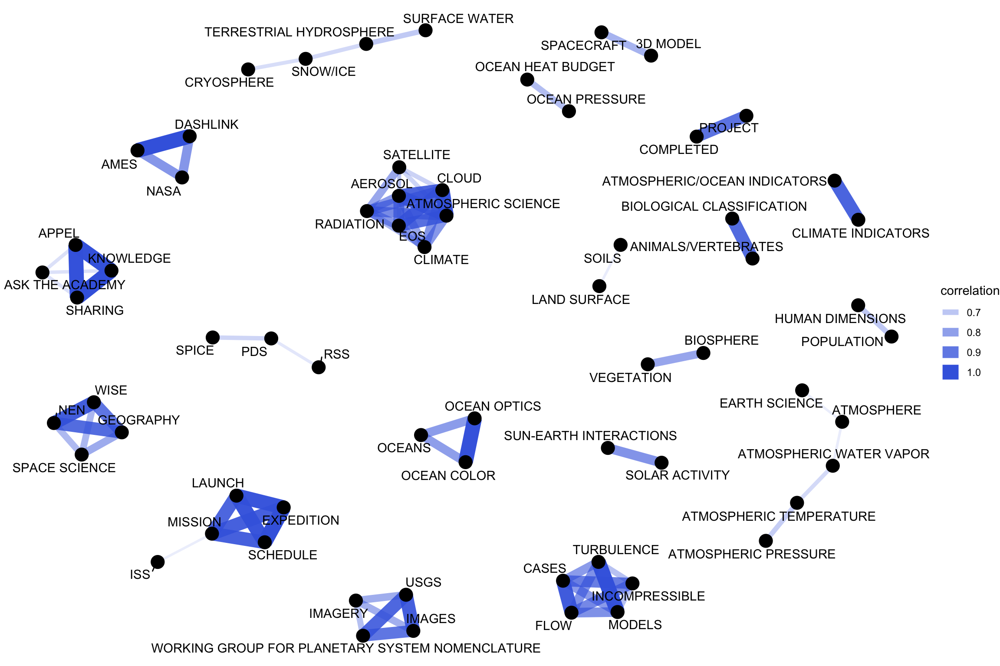
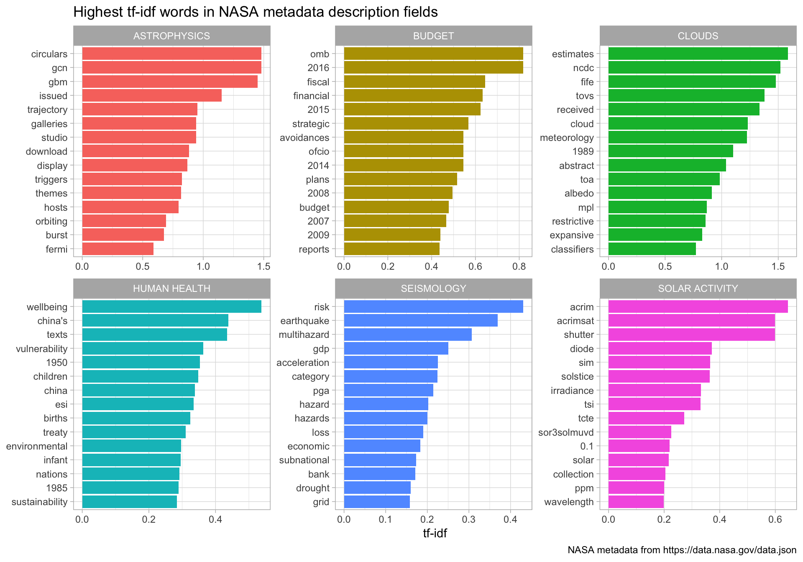
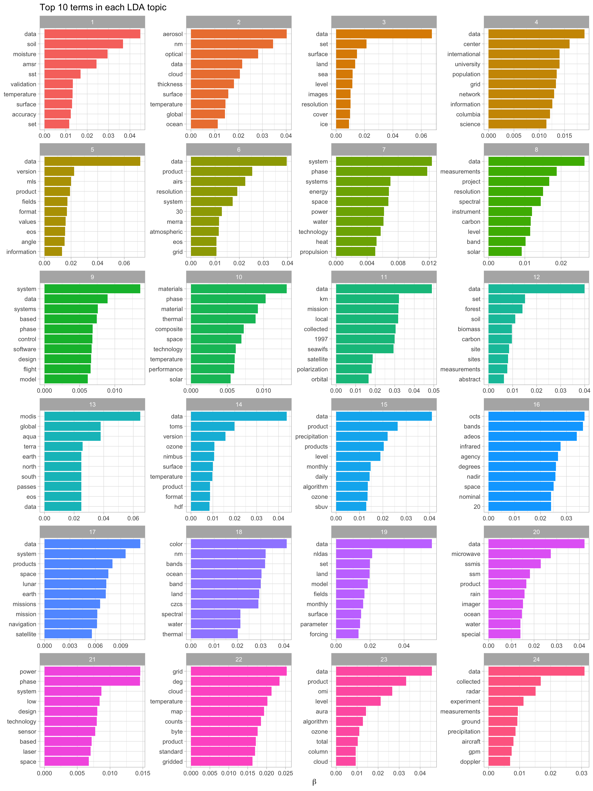
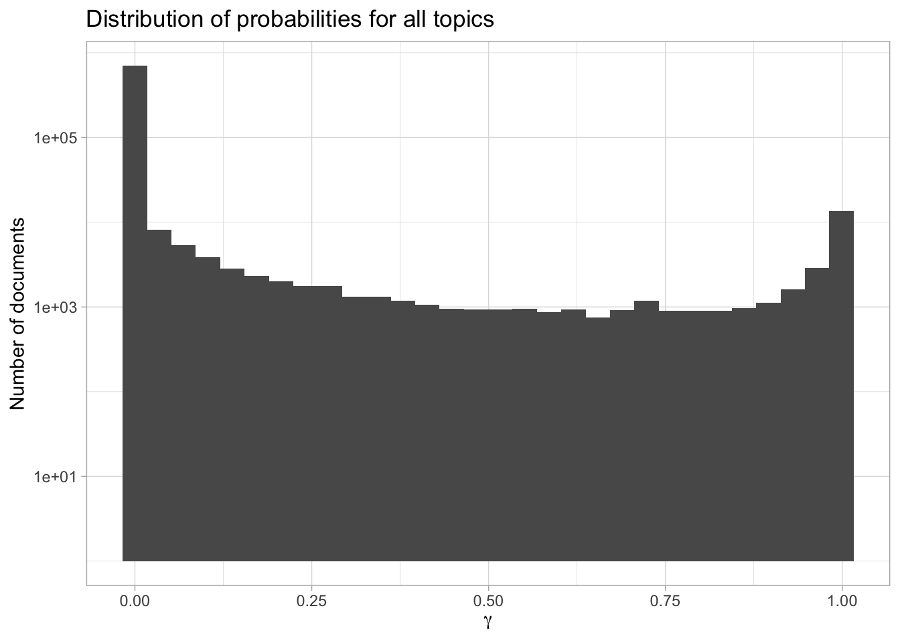
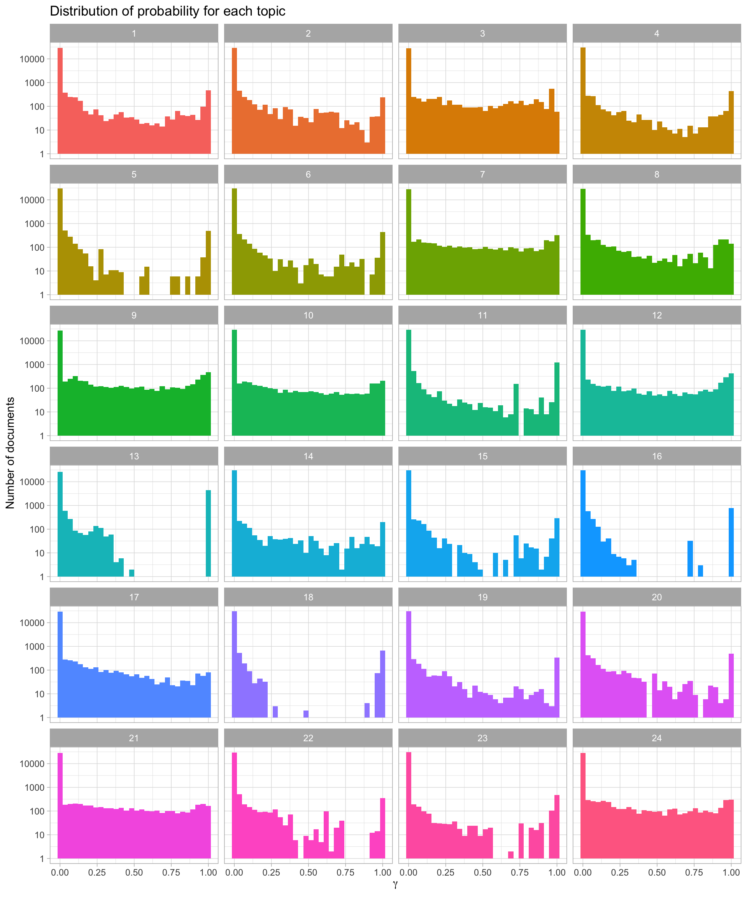
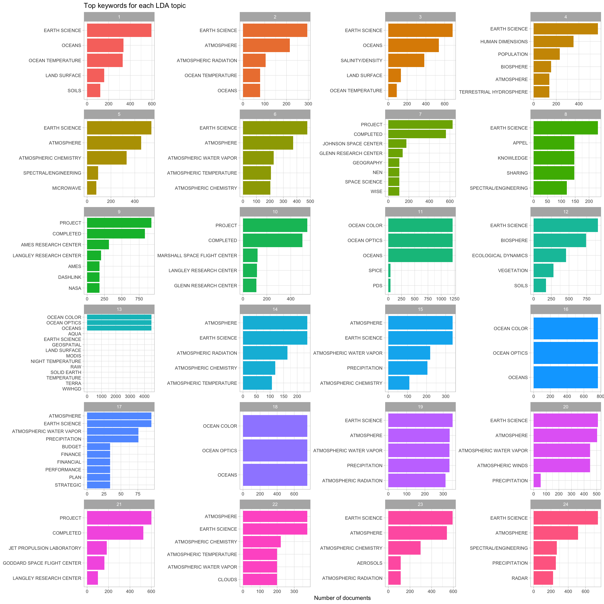

# 8 Case study: mining NASA metadata

There are over 32,000 datasets hosted and/or maintained by
[NASA](https://www.nasa.gov/); these datasets cover topics from Earth
science to aerospace engineering to management of NASA itself. We can
use the metadata for these datasets to understand the connections
between them.

> What is metadata? Metadata is a term that refers to data that gives
> information about other data; in this case, the metadata informs users
> about what is in these numerous NASA datasets but does not include the
> content of the datasets themselves.

The metadata includes information like the title of the dataset, a
description field, what organization(s) within NASA is responsible for
the dataset, keywords for the dataset that have been assigned by a human
being, and so forth. NASA places a high priority on making its data open
and accessible, even requiring all NASA-funded research to be [openly
accessible
online](https://www.nasa.gov/press-release/nasa-unveils-new-public-web-portal-for-research-results).
The metadata for all its datasets is [publicly available online in JSON
format](https://data.nasa.gov/data.json).

In this chapter, we will treat the NASA metadata as a text dataset and
show how to implement several tidy text approaches with this real-life
text. We will use word co-occurrences and correlations, tf-idf, and
topic modeling to explore the connections between the datasets. Can we
find datasets that are related to each other? Can we find clusters of
similar datasets? Since we have several text fields in the NASA
metadata, most importantly the title, description, and keyword fields,
we can explore the connections between the fields to better understand
the complex world of data at NASA. This type of approach can be extended
to any domain that deals with text, so let’s take a look at this
metadata and get started.

## 8.1 How data is organized at NASA

First, let’s download the JSON file and take a look at the names of what
is stored in the metadata.

``` r
library(jsonlite)
metadata <- fromJSON("https://data.nasa.gov/data.json")
names(metadata$dataset)
```

    ##  [1] "_id"                "@type"              "accessLevel"        "accrualPeriodicity"
    ##  [5] "bureauCode"         "contactPoint"       "description"        "distribution"      
    ##  [9] "identifier"         "issued"             "keyword"            "landingPage"       
    ## [13] "language"           "modified"           "programCode"        "publisher"         
    ## [17] "spatial"            "temporal"           "theme"              "title"             
    ## [21] "license"            "isPartOf"           "references"         "rights"            
    ## [25] "describedBy"

We see here that we could extract information from who publishes each
dataset to what license they are released under.

It seems likely that the title, description, and keywords for each
dataset may be most fruitful for drawing connections between datasets.
Let’s check them out.

``` r
class(metadata$dataset$title)
class(metadata$dataset$description)
class(metadata$dataset$keyword)
```

    ## [1] "character"
    ## [1] "character"
    ## [1] "list"

The title and description fields are stored as character vectors, but
the keywords are stored as a list of character vectors.

### 8.1.1 Wrangling and tidying the data

Let’s set up separate tidy data frames for title, description, and
keyword, keeping the dataset ids for each so that we can connect them
later in the analysis if necessary.

``` r
library(dplyr)

nasa_title <- data_frame(id    = metadata$dataset$`_id`$`$oid`,
                         title = metadata$dataset$title)
nasa_title
```

    ## # A tibble: 32,089 x 2
    ##    id                       title                                              
    ##    <chr>                    <chr>                                              
    ##  1 55942a57c63a7fe59b495a77 15 Minute Stream Flow Data: USGS (FIFE)            
    ##  2 55942a57c63a7fe59b495a78 15 Minute Stream Flow Data: USGS (FIFE)            
    ##  3 55942a58c63a7fe59b495a79 15 Minute Stream Flow Data: USGS (FIFE)            
    ##  4 55942a58c63a7fe59b495a7a 2000 Pilot Environmental Sustainability Index (ESI)
    ##  5 55942a58c63a7fe59b495a7b 2000 Pilot Environmental Sustainability Index (ESI)
    ##  6 55942a58c63a7fe59b495a7c 2000 Pilot Environmental Sustainability Index (ESI)
    ##  7 55942a58c63a7fe59b495a7d 2001 Environmental Sustainability Index (ESI)      
    ##  8 55942a58c63a7fe59b495a7e 2001 Environmental Sustainability Index (ESI)      
    ##  9 55942a58c63a7fe59b495a7f 2001 Environmental Sustainability Index (ESI)      
    ## 10 55942a58c63a7fe59b495a80 2001 Environmental Sustainability Index (ESI)      
    ## # … with 32,079 more rows

These are just a few example titles from the datasets we will be
exploring. Notice that we have the NASA-assigned ids here, and also that
there are duplicate titles on separate datasets.

``` r
nasa_desc <- data_frame(id   = metadata$dataset$`_id`$`$oid`,
                        desc = metadata$dataset$description)
set.seed(1)  # get the same samples
nasa_desc %>%
  select(desc) %>%
  sample_n(5)
```

    ## # A tibble: 5 x 1
    ##   desc                                                                                              
    ##   <chr>                                                                                             
    ## 1 The GMI BASE Product, GMIBASE, GMI Antenna Temperatures, is written as a multi-Swath Structure. S…
    ## 2 This phase I SBIR project will develop a micromachined charged particle energy collimator plate t…
    ## 3 "The Modern-Era Retrospective Analysis for Research and Applications (MERRA) is a state-of-the-ar…
    ## 4 "MODIS (or Moderate Resolution Imaging Spectroradiometer) is a key instrument aboard the\nTerra (…
    ## 5 The Advanced Microwave Precipitation Radiometer (AMPR) was deployed during the Tropical Rainfall …

Here we see the first part of several selected description fields from
the metadata.

Now we can build the tidy data frame for the keywords. For this one, we
need to use `unnest()` from tidyr, because they are in a list-column.

``` r
library(tidyr)

nasa_keyword <- data_frame(id      = metadata$dataset$`_id`$`$oid`,
                           keyword = metadata$dataset$keyword) %>%
  unnest(keyword)

nasa_keyword
```

    ## # A tibble: 126,814 x 2
    ##    id                       keyword      
    ##    <chr>                    <chr>        
    ##  1 55942a57c63a7fe59b495a77 EARTH SCIENCE
    ##  2 55942a57c63a7fe59b495a77 HYDROSPHERE  
    ##  3 55942a57c63a7fe59b495a77 SURFACE WATER
    ##  4 55942a57c63a7fe59b495a78 EARTH SCIENCE
    ##  5 55942a57c63a7fe59b495a78 HYDROSPHERE  
    ##  6 55942a57c63a7fe59b495a78 SURFACE WATER
    ##  7 55942a58c63a7fe59b495a79 EARTH SCIENCE
    ##  8 55942a58c63a7fe59b495a79 HYDROSPHERE  
    ##  9 55942a58c63a7fe59b495a79 SURFACE WATER
    ## 10 55942a58c63a7fe59b495a7a EARTH SCIENCE
    ## # … with 126,804 more rows

This is a tidy data frame because we have one row for each keyword; this
means we will have multiple rows for each dataset because a dataset can
have more than one keyword.

Now it is time to use tidytext’s `unnest_tokens()` for the title and
description fields so we can do the text analysis. Let’s also remove
stop words from the titles and descriptions. We will not remove stop
words from the keywords, because those are short, human-assigned
keywords like “RADIATION” or “CLIMATE INDICATORS”.

``` r
library(tidytext)

nasa_title <- nasa_title %>%
  unnest_tokens(word, title) %>%
  anti_join(stop_words)

nasa_desc <- nasa_desc %>%
  unnest_tokens(word, desc) %>%
  anti_join(stop_words)
```

These are now in the tidy text format that we have been working with
throughout this book, with one token (word, in this case) per row; let’s
take a look before we move on in our analysis.

``` r
nasa_title
nasa_desc
```

    ## # A tibble: 210,914 x 2
    ##    id                       word  
    ##    <chr>                    <chr> 
    ##  1 55942a57c63a7fe59b495a77 15    
    ##  2 55942a57c63a7fe59b495a77 minute
    ##  3 55942a57c63a7fe59b495a77 stream
    ##  4 55942a57c63a7fe59b495a77 flow  
    ##  5 55942a57c63a7fe59b495a77 data  
    ##  6 55942a57c63a7fe59b495a77 usgs  
    ##  7 55942a57c63a7fe59b495a77 fife  
    ##  8 55942a57c63a7fe59b495a78 15    
    ##  9 55942a57c63a7fe59b495a78 minute
    ## 10 55942a57c63a7fe59b495a78 stream
    ## # … with 210,904 more rows
    ## # A tibble: 2,677,811 x 2
    ##    id                       word   
    ##    <chr>                    <chr>  
    ##  1 55942a57c63a7fe59b495a77 usgs   
    ##  2 55942a57c63a7fe59b495a77 15     
    ##  3 55942a57c63a7fe59b495a77 minute 
    ##  4 55942a57c63a7fe59b495a77 stream 
    ##  5 55942a57c63a7fe59b495a77 flow   
    ##  6 55942a57c63a7fe59b495a77 data   
    ##  7 55942a57c63a7fe59b495a77 kings  
    ##  8 55942a57c63a7fe59b495a77 creek  
    ##  9 55942a57c63a7fe59b495a77 konza  
    ## 10 55942a57c63a7fe59b495a77 prairie
    ## # … with 2,677,801 more rows

### 8.1.2 Some initial simple exploration

What are the most common words in the NASA dataset titles? We can use
`count()` from dplyr to check this out.

``` r
nasa_title %>%
  count(word, sort = TRUE)
```

    ## # A tibble: 11,614 x 2
    ##    word        n
    ##    <chr>   <int>
    ##  1 project  7735
    ##  2 data     3354
    ##  3 1        2841
    ##  4 level    2400
    ##  5 global   1809
    ##  6 v1       1478
    ##  7 daily    1397
    ##  8 3        1364
    ##  9 aura     1363
    ## 10 l2       1311
    ## # … with 11,604 more rows

What about the descriptions?

``` r
nasa_desc %>%
  count(word, sort = TRUE)
```

    ## # A tibble: 35,940 x 2
    ##    word           n
    ##    <chr>      <int>
    ##  1 data       68871
    ##  2 modis      24420
    ##  3 global     23028
    ##  4 2          16599
    ##  5 1          15770
    ##  6 system     15480
    ##  7 product    14780
    ##  8 aqua       14738
    ##  9 earth      14373
    ## 10 resolution 13879
    ## # … with 35,930 more rows

Words like “data” and “global” are used very often in NASA titles and
descriptions. We may want to remove digits and some “words” like “v1”
from these data frames for many types of analyses; they are not too
meaningful for most audiences.

> We can do this by making a list of custom stop words and using
> `anti_join()` to remove them from the data frame, just like we removed
> the default stop words that are in the tidytext package. This approach
> can be used in many instances and is a great tool to bear in mind.

``` r
my_stopwords <- data_frame(word = c(
    as.character(1:10),  # "1" to "10"
    "v1", "v03", "l2", "l3", "l4", "v5.2.0",
    "v003", "v004", "v005", "v006", "v7"
  ))

nasa_title <- nasa_title %>%
  anti_join(my_stopwords)
nasa_desc <- nasa_desc %>%
  anti_join(my_stopwords)
```

What are the most common keywords?

``` r
nasa_keyword %>%
  group_by(keyword) %>%
  count(sort = TRUE)

# this is the same as
# nasa_keyword %>%
#   count(keyword, sort = TRUE)
```

    ## # A tibble: 1,774 x 2
    ## # Groups:   keyword [1,774]
    ##    keyword                     n
    ##    <chr>                   <int>
    ##  1 EARTH SCIENCE           14362
    ##  2 Project                  7452
    ##  3 ATMOSPHERE               7321
    ##  4 Ocean Color              7268
    ##  5 Ocean Optics             7268
    ##  6 Oceans                   7268
    ##  7 completed                6452
    ##  8 ATMOSPHERIC WATER VAPOR  3142
    ##  9 OCEANS                   2765
    ## 10 LAND SURFACE             2720
    ## # … with 1,764 more rows

We likely want to change all of the keywords to either lower or upper
case to get rid of duplicates like “OCEANS” and “Oceans”. Let’s do that
here.

``` r
nasa_keyword <- nasa_keyword %>%
  mutate(keyword = toupper(keyword))
```

## 8.2 Word co-ocurrences and correlations

As a next step, let’s examine which words commonly occur together in the
titles, descriptions, and keywords of NASA datasets, as described in
Chapter 4. We can then examine word networks for these fields; this may
help us see, for example, which datasets are related to each other.

### 8.2.1 Networks of Description and Title Words

We can use `pairwise_count()` from the widyr package to count how many
times each pair of words occurs together in a title or description
field.

``` r
library(widyr)

title_word_pairs <- nasa_title %>%
  pairwise_count(word, id, sort = TRUE, upper = FALSE)
  # upper: whether to include upper triangle, which may be duplicated

title_word_pairs
```

    ## # A tibble: 156,689 x 3
    ##    item1  item2       n
    ##    <chr>  <chr>   <dbl>
    ##  1 system project   796
    ##  2 lba    eco       683
    ##  3 airs   aqua      641
    ##  4 level  aqua      623
    ##  5 level  airs      612
    ##  6 aura   omi       607
    ##  7 global grid      597
    ##  8 global daily     574
    ##  9 data   boreas    551
    ## 10 ground gpm       550
    ## # … with 156,679 more rows

These are the pairs of words that occur together most often in title
fields. Some of these words are obviously acronyms used within NASA, and
we see how often words like “project” and “system” are used.

``` r
desc_word_pairs <- nasa_desc %>%
  pairwise_count(word, id, sort = TRUE, upper = FALSE)

desc_word_pairs
```

    ## # A tibble: 10,889,084 x 3
    ##    item1      item2          n
    ##    <chr>      <chr>      <dbl>
    ##  1 data       global      9864
    ##  2 data       resolution  9302
    ##  3 instrument resolution  8189
    ##  4 data       surface     8180
    ##  5 global     resolution  8139
    ##  6 data       instrument  7994
    ##  7 data       system      7870
    ##  8 resolution bands       7584
    ##  9 data       earth       7576
    ## 10 orbit      resolution  7462
    ## # … with 10,889,074 more rows

These are the pairs of words that occur together most often in
descripton fields. “Data” is a very common word in description fields;
there is no shortage of data in the datasets at NASA\!

Let’s plot networks of these co-occurring words so we can see these
relationships better in Figure 8.1. We will again use the ggraph package
for visualizing our networks.

``` r
library(ggplot2)
library(igraph)
library(ggraph)

set.seed(1234)
title_word_pairs %>%
  filter(n >= 250) %>%
  graph_from_data_frame() %>%
  ggraph(layout = "fr") +
  geom_edge_link(aes(edge_alpha = n, edge_width = n), edge_colour = "cyan4") +
  geom_node_point(size = 5) +
  geom_node_text(aes(label = name), repel = TRUE,
                 point.padding = unit(0.2, "lines")) +
  # text labels will be repelled from each other to avoid overlapping
  theme_void()
```



(Figure 8.1: Word network in NASA dataset titles)

We see some clear clustering in this network of title words; words in
NASA dataset titles are largely organized into several families of words
that tend to go together.

What about the words from the description fields?

``` r
set.seed(1234)
desc_word_pairs %>%
  filter(n >= 5000) %>%
  graph_from_data_frame() %>%
  ggraph(layout = "fr") +
  geom_edge_link(aes(edge_alpha = n, edge_width = n), edge_colour = "darkred") +
  geom_node_point(size = 5) +
  geom_node_text(aes(label = name), repel = TRUE,
                 point.padding = unit(0.2, "lines")) +
  theme_void()
```



(Figure 8.2: Word network in NASA dataset descriptions)

Figure 8.2 shows such *strong* connections between the top dozen or so
words (words like “data”, “global”, “resolution”, and “instrument”) that
we do not see clear clustering structure in the network. We may want to
use tf-idf (as described in detail in Chapter 3) as a metric to find
characteristic words for each description field, instead of looking at
counts of words.

### 8.2.2 Networks of Keywords

Next, let’s make a network of the keywords in Figure 8.3 to see which
keywords commonly occur together in the same datasets.

``` r
keyword_pairs <- nasa_keyword %>%
  pairwise_count(keyword, id, sort = TRUE, upper = FALSE)

keyword_pairs

set.seed(1234)
keyword_pairs %>%
  filter(n >= 700) %>%
  graph_from_data_frame() %>%
  ggraph(layout = "fr") +
  geom_edge_link(aes(edge_alpha = n, edge_width = n), edge_colour = "royalblue") +
  geom_node_point(size = 5) +
  geom_node_text(aes(label = name), repel = TRUE,
                 point.padding = unit(0.2, "lines")) +
  theme_void()
```

    ## # A tibble: 13,390 x 3
    ##    item1         item2                       n
    ##    <chr>         <chr>                   <dbl>
    ##  1 OCEANS        OCEAN OPTICS             7324
    ##  2 EARTH SCIENCE ATMOSPHERE               7318
    ##  3 OCEANS        OCEAN COLOR              7270
    ##  4 OCEAN OPTICS  OCEAN COLOR              7270
    ##  5 PROJECT       COMPLETED                6450
    ##  6 EARTH SCIENCE ATMOSPHERIC WATER VAPOR  3142
    ##  7 ATMOSPHERE    ATMOSPHERIC WATER VAPOR  3142
    ##  8 EARTH SCIENCE OCEANS                   2762
    ##  9 EARTH SCIENCE LAND SURFACE             2718
    ## 10 EARTH SCIENCE BIOSPHERE                2448
    ## # … with 13,380 more rows



(Figure 8.3: Co-occurrence network in NASA dataset keywords)

We definitely see clustering here, and strong connections between
keywords like “OCEANS”, “OCEAN OPTICS”, and “OCEAN COLOR”, or “PROJECT”
and “COMPLETED”.

> These are the most commonly co-occurring words, but also just the most
> common keywords in general.

To examine the relationships among keywords in a different way, we can
find the correlation among the keywords as described in Chapter 4. This
looks for those keywords that are more likely to occur together than
with other keywords.

``` r
keyword_cors <- nasa_keyword %>%
  group_by(keyword) %>%
  filter(n() >= 50) %>%
  pairwise_cor(keyword, id, sort = TRUE, upper = FALSE)

keyword_cors
```

    ## # A tibble: 7,875 x 3
    ##    item1               item2       correlation
    ##    <chr>               <chr>             <dbl>
    ##  1 KNOWLEDGE           SHARING           1.   
    ##  2 DASHLINK            AMES              1    
    ##  3 SCHEDULE            EXPEDITION        1.000
    ##  4 TURBULENCE          MODELS            0.997
    ##  5 APPEL               KNOWLEDGE         0.997
    ##  6 APPEL               SHARING           0.997
    ##  7 OCEAN OPTICS        OCEAN COLOR       0.995
    ##  8 ATMOSPHERIC SCIENCE CLOUD             0.994
    ##  9 LAUNCH              SCHEDULE          0.984
    ## 10 LAUNCH              EXPEDITION        0.984
    ## # … with 7,865 more rows

Notice that these keywords at the top of this sorted data frame have
correlation coefficients equal to 1; they always occur together. This
means these are redundant keywords. It may not make sense to continue to
use both of the keywords in these sets of pairs; instead, just one
keyword could be used.

Let’s visualize the network of keyword correlations, just as we did for
keyword co-occurences.

``` r
set.seed(1234)
keyword_cors %>%
  filter(correlation > .6) %>%
  graph_from_data_frame() %>%
  ggraph(layout = "fr") +
  geom_edge_link(aes(edge_alpha = correlation, edge_width = correlation),
                 edge_colour = "royalblue") +
  geom_node_point(size = 5) +
  geom_node_text(aes(label = name), repel = TRUE,
                 point.padding = unit(0.2, "lines")) +
  theme_void()
```



(Figure 8.4: Correlation network in NASA dataset keywords)

This network in Figure 8.4 appears much different than the co-occurence
network. The difference is that the co-occurrence network asks a
question about which keyword pairs occur most often, and the correlation
network asks a question about which keywords occur more often together
than with other keywords. Notice here the high number of small clusters
of keywords; the network structure can be extracted (for further
analysis) from the `graph_from_data_frame()` function above.

## 8.3 Calculating tf-idf for the description fields

The network graph in Figure 8.2 showed us that the description fields
are dominated by a few common words like “data”, “global”, and
“resolution”; this would be an excellent opportunity to use tf-idf as
a statistic to find characteristic words for individual description
fields. As discussed in Chapter 3, we can use tf-idf, the term frequency
times inverse document frequency, to identify words that are especially
important to a document within a collection of documents. Let’s apply
that approach to the description fields of these NASA datasets.

### 8.3.1 What is tf-idf for the description field words?

We will consider each description field a document, and the whole set of
description fields the collection or corpus of documents. We have
already used `unnest_tokens()` earlier in this chapter to make a tidy
data frame of the words in the description fields, so now we can use
`bind_tf_idf()` to calculate tf-idf for each word.

``` r
desc_tf_idf <- nasa_desc %>%
  count(id, word, sort = TRUE) %>%
  ungroup() %>%
  bind_tf_idf(word, id, n)
```

What are the highest tf-idf words in the NASA description fields?

``` r
desc_tf_idf %>%
  arrange(-tf_idf)
```

    ## # A tibble: 1,913,224 x 6
    ##    id                       word                                              n    tf   idf tf_idf
    ##    <chr>                    <chr>                                         <int> <dbl> <dbl>  <dbl>
    ##  1 55942a7cc63a7fe59b49774a rdr                                               1     1 10.4   10.4 
    ##  2 55942ac9c63a7fe59b49b688 palsar_radiometric_terrain_corrected_high_res     1     1 10.4   10.4 
    ##  3 55942ac9c63a7fe59b49b689 palsar_radiometric_terrain_corrected_low_res      1     1 10.4   10.4 
    ##  4 55942a7bc63a7fe59b4976ca lgrs                                              1     1  8.77   8.77
    ##  5 55942a7bc63a7fe59b4976d2 lgrs                                              1     1  8.77   8.77
    ##  6 55942a7bc63a7fe59b4976e3 lgrs                                              1     1  8.77   8.77
    ##  7 55942a7dc63a7fe59b497820 mri                                               1     1  8.58   8.58
    ##  8 55942ad8c63a7fe59b49cf6c template_proddescription                          1     1  8.30   8.30
    ##  9 55942ad8c63a7fe59b49cf6d template_proddescription                          1     1  8.30   8.30
    ## 10 55942ad8c63a7fe59b49cf6e template_proddescription                          1     1  8.30   8.30
    ## # … with 1,913,214 more rows

These are the most important words in the description fields as measured
by tf-idf, meaning they are common but not too common.

> Notice we have run into an issue here; both \(n\) and term frequency
> are equal to 1 for these terms, meaning that these were description
> fields that only had a single word in them. If a description field
> only contains one word, the tf-idf algorithm will think that is a very
> important word.

Depending on our analytic goals, it might be a good idea to throw out
all description fields that have very few words.

### 8.3.2 Connecting description fields to keywords

We now know which words in the descriptions have high tf-idf, and we
also have labels for these descriptions in the keywords. Let’s do a full
join of the keyword data frame and the data frame of description words
with tf-idf, and then find the highest tf-idf words for a given keyword.

``` r
desc_tf_idf <- full_join(desc_tf_idf, nasa_keyword, by = "id")

desc_tf_idf
```

    ## # A tibble: 7,749,613 x 7
    ##    id                       word      n     tf   idf tf_idf keyword             
    ##    <chr>                    <chr> <int>  <dbl> <dbl>  <dbl> <chr>               
    ##  1 55942a88c63a7fe59b498280 amp     679 0.397   3.18  1.26  ELEMENT             
    ##  2 55942a88c63a7fe59b498280 amp     679 0.397   3.18  1.26  JOHNSON SPACE CENTER
    ##  3 55942a88c63a7fe59b498280 amp     679 0.397   3.18  1.26  VOR                 
    ##  4 55942a88c63a7fe59b498280 amp     679 0.397   3.18  1.26  ACTIVE              
    ##  5 55942a88c63a7fe59b498280 nbsp    655 0.383   4.21  1.61  ELEMENT             
    ##  6 55942a88c63a7fe59b498280 nbsp    655 0.383   4.21  1.61  JOHNSON SPACE CENTER
    ##  7 55942a88c63a7fe59b498280 nbsp    655 0.383   4.21  1.61  VOR                 
    ##  8 55942a88c63a7fe59b498280 nbsp    655 0.383   4.21  1.61  ACTIVE              
    ##  9 55942a8ec63a7fe59b4986ef gt      330 0.0926  3.23  0.299 JOHNSON SPACE CENTER
    ## 10 55942a8ec63a7fe59b4986ef gt      330 0.0926  3.23  0.299 PROJECT             
    ## # … with 7,749,603 more rows

Let’s plot some of the most important words, as measured by tf-idf, for
a few example keywords used on NASA datasets. First, let’s use dplyr
operations to filter for the keywords we want to examine and take just
the top 15 words for each keyword. Then, let’s plot those words in
Figure 8.5.

``` r
desc_tf_idf %>%
  filter(!near(tf, 1)) %>%
    # near(): == with tolerance, to compare floats
  filter(keyword %in% c(
    "SOLAR ACTIVITY", "CLOUDS", "SEISMOLOGY",
    "ASTROPHYSICS", "HUMAN HEALTH", "BUDGET"
  )) %>%
  arrange(desc(tf_idf)) %>%
  group_by(keyword) %>%
  distinct(word, keyword, .keep_all = TRUE) %>%
    # if duplicate, only the first row will be preserved
    # .keep_all: keep all variables in tbl
  top_n(15, tf_idf) %>%
  ungroup() %>%
  mutate(word = factor(word, levels = rev(unique(word)))) %>%
  ggplot(aes(word, tf_idf, fill = keyword)) +
  geom_col(show.legend = FALSE) +
  facet_wrap(~keyword, ncol = 3, scales = "free") +
  coord_flip() +
  labs(title = "Highest tf-idf words in NASA metadata description fields",
       caption = "NASA metadata from https://data.nasa.gov/data.json",
       x = NULL, y = "tf-idf")
```



(Figure 8.5: Distribution of tf-idf for words from datasets labeled with
selected keywords)

Using tf-idf has allowed us to identify important description words for
each of these keywords. Datasets labeled with the keyword “SEISMOLOGY”
have words like “earthquake”, “risk”, and “hazard” in their description,
while those labeled with “HUMAN HEALTH” have descriptions characterized
by words like “wellbeing”, “vulnerability”, and “children.” Most of the
combinations of letters that are not English words are certainly
acronyms (like OMB for the Office of Management and Budget), and the
examples of years and numbers are important for these topics. The tf-idf
statistic has identified the kinds of words it is intended to, important
words for individual documents within a collection of documents.

## 8.4 Topic modeling

Using tf-idf as a statistic has already given us insight into the
content of NASA description fields, but let’s try an additional approach
to the question of what the NASA descriptions fields are about. We can
use topic modeling as described in Chapter 6 to model each document
(description field) as a mixture of topics and each topic as a mixture
of words. As in earlier chapters, we will use [latent Dirichlet
allocation
(LDA)](https://en.wikipedia.org/wiki/Latent_Dirichlet_allocation) for
our topic modeling; there are other possible approaches for topic
modeling.

### 8.4.1 Casting to a document-term matrix

To do the topic modeling as implemented here, we need to make a
`DocumentTermMatrix`, a special kind of matrix from the tm package (of
course, this is just a specific implementation of the general concept of
a “document-term matrix”). Rows correspond to documents (description
texts in our case) and columns correspond to terms (i.e., words); it is
a sparse matrix and the values are word counts.

Let’s clean up the text a bit using stop words to remove some of the
nonsense “words” leftover from HTML or other character encoding. We can
use `bind_rows()` to add our custom stop words to the list of default
stop words from the tidytext package, and then all at once use
`anti_join()` to remove them all from our data frame.

``` r
my_stop_words <- bind_rows(
  stop_words,
  data_frame(word = c("nbsp", "amp", "gt", "lt",
                      "timesnewromanpsmt", "font",
                      "td", "li", "br", "tr", "quot",
                      "st", "img", "src", "strong",
                      "http", "file", "files",
                      as.character(1:12)),
             lexicon = rep("custom", 30))
  )

word_counts <- nasa_desc %>%
  anti_join(my_stop_words) %>%
  count(id, word, sort = TRUE) %>%
  ungroup()

word_counts
```

    ## # A tibble: 1,895,310 x 3
    ##    id                       word         n
    ##    <chr>                    <chr>    <int>
    ##  1 55942a8ec63a7fe59b4986ef suit        82
    ##  2 55942a8ec63a7fe59b4986ef space       69
    ##  3 56cf5b00a759fdadc44e564a data        41
    ##  4 56cf5b00a759fdadc44e564a leak        40
    ##  5 56cf5b00a759fdadc44e564a tree        39
    ##  6 55942a8ec63a7fe59b4986ef pressure    34
    ##  7 55942a8ec63a7fe59b4986ef system      34
    ##  8 55942a89c63a7fe59b4982d9 em          32
    ##  9 55942a8ec63a7fe59b4986ef al          32
    ## 10 55942a8ec63a7fe59b4986ef human       31
    ## # … with 1,895,300 more rows

This is the information we need, the number of times each word is used
in each document, to make a `DocumentTermMatrix`. We can `cast()` from
our tidy text format to this non-tidy format as described in detail in
Chapter 5.

``` r
desc_dtm <- word_counts %>%
  cast_dtm(id, word, n)

desc_dtm
```

    ## <<DocumentTermMatrix (documents: 32003, terms: 35901)>>
    ## Non-/sparse entries: 1895310/1147044393
    ## Sparsity           : 100%
    ## Maximal term length: 166
    ## Weighting          : term frequency (tf)

We see that this dataset contains documents (each of them a NASA
description field) and terms (words). Notice that this example
document-term matrix is (very close to) 100% sparse, meaning that almost
all of the entries in this matrix are zero. Each non-zero entry
corresponds to a certain word appearing in a certain document.

### 8.4.2 Ready for topic modeling

Now let’s use the
[topicmodels](https://cran.r-project.org/package=topicmodels) package to
create an LDA model. How many topics will we tell the algorithm to make?
This is a question much like in \(k\)-means clustering; we don’t really
know ahead of time. We tried the following modeling procedure using 8,
16, 24, 32, and 64 topics; we found that at 24 topics, documents are
still getting sorted into topics cleanly but going much beyond that
caused the distributions of \(\gamma\), the probability that each
document belongs in each topic, to look worrisome. We will show more
details on this later.

``` r
library(topicmodels)

# be aware that running this model is time intensive
desc_lda <- LDA(desc_dtm, k = 24, control = list(seed = 1234))
desc_lda
```

    ## A LDA_VEM topic model with 24 topics.

This is a stochastic algorithm that could have different results
depending on where the algorithm starts, so we need to specify a `seed`
for reproducibility as shown here.

### 8.4.3 Interpreting the topic model

Now that we have built the model, let’s `tidy()` the results of the
model, i.e., construct a tidy data frame that summarizes the results of
the model. The tidytext package includes a tidying method for LDA models
from the topicmodels package.

``` r
tidy_lda <- tidy(desc_lda)

tidy_lda
```

    ## # A tibble: 861,624 x 3
    ##    topic term       beta
    ##    <int> <chr>     <dbl>
    ##  1     1 suit  1.00e-121
    ##  2     2 suit  2.63e-145
    ##  3     3 suit  1.92e- 79
    ##  4     4 suit  6.72e- 45
    ##  5     5 suit  1.74e- 85
    ##  6     6 suit  7.69e- 84
    ##  7     7 suit  3.28e-  4
    ##  8     8 suit  3.74e- 20
    ##  9     9 suit  4.85e- 15
    ## 10    10 suit  4.77e- 10
    ## # … with 861,614 more rows

The column \(\beta\) tells us the probability of that term being
generated from that topic for that document. It is the probability of
that term (word) belonging to that topic. Notice that some of the values
for \(\beta\) are very, very low, and some are not so low.

What is each topic about? Let’s examine the top 10 terms for each topic.

``` r
top_terms <- tidy_lda %>%
  group_by(topic) %>%
  top_n(10, beta) %>%
  ungroup() %>%
  arrange(topic, -beta)

top_terms
```

    ## # A tibble: 240 x 3
    ##    topic term          beta
    ##    <int> <chr>        <dbl>
    ##  1     1 data        0.0449
    ##  2     1 soil        0.0368
    ##  3     1 moisture    0.0295
    ##  4     1 amsr        0.0244
    ##  5     1 sst         0.0168
    ##  6     1 validation  0.0132
    ##  7     1 temperature 0.0132
    ##  8     1 surface     0.0129
    ##  9     1 accuracy    0.0123
    ## 10     1 set         0.0116
    ## # … with 230 more rows

It is not very easy to interpret what the topics are about from a data
frame like this so let’s look at this information visually in Figure
8.6.

``` r
top_terms %>%
  mutate(term = reorder(term, beta)) %>%
  #group_by(topic, term) %>%  # seems redundant
  #arrange(desc(beta)) %>%  # seems redundant
  #ungroup() %>%  # seems redundant
  mutate(term = factor(paste(term, topic, sep = "__"),
                       levels = rev(paste(term, topic, sep = "__")))) %>%
  ggplot(aes(term, beta, fill = as.factor(topic))) +
  geom_col(show.legend = FALSE) +
  coord_flip() +
  scale_x_discrete(labels = function(x) gsub("__.+$", "", x)) +
  labs(title = "Top 10 terms in each LDA topic",
       x = NULL, y = expression(beta)) +
  facet_wrap(~ topic, ncol = 4, scales = "free")
```



(Figure 8.6: Top terms in topic modeling of NASA metadata description
field texts)

We can see what a dominant word “data” is in these description texts. In
addition, there are meaningful differences between these collections of
terms, from terms about soil, forests, and biomass in topic 12 to terms
about design, systems, and technology in topic 21. The topic modeling
process has identified groupings of terms that we can understand as
human readers of these description fields.

We just explored which words are associated with which topics. Next,
let’s examine which topics are associated with which description
fields (i.e., documents). We will look at a different probability for
this, \(\gamma\), the probability that each document belongs in each
topic, again using the `tidy` verb.

``` r
lda_gamma <- tidy(desc_lda, matrix = "gamma")

lda_gamma
```

    ## # A tibble: 768,072 x 3
    ##    document                 topic      gamma
    ##    <chr>                    <int>      <dbl>
    ##  1 55942a8ec63a7fe59b4986ef     1 0.00000645
    ##  2 56cf5b00a759fdadc44e564a     1 0.0000116 
    ##  3 55942a89c63a7fe59b4982d9     1 0.0492    
    ##  4 56cf5b00a759fdadc44e55cd     1 0.0000225 
    ##  5 55942a89c63a7fe59b4982c6     1 0.0000661 
    ##  6 55942a86c63a7fe59b498077     1 0.0000567 
    ##  7 56cf5b00a759fdadc44e56f8     1 0.0000475 
    ##  8 55942a8bc63a7fe59b4984b5     1 0.0000431 
    ##  9 55942a6ec63a7fe59b496bf7     1 0.0000441 
    ## 10 55942a8ec63a7fe59b4986f6     1 0.0000288 
    ## # … with 768,062 more rows

Notice that some of the probabilites visible at the top of the data
frame are low and some are higher. Our model has assigned a probability
to each description belonging to each of the topics we constructed from
the sets of words. How are the probabilities distributed? Let’s
visualize them (Figure 8.7).

``` r
ggplot(lda_gamma, aes(gamma)) +
  geom_histogram() +
  scale_y_log10() +
  labs(title = "Distribution of probabilities for all topics",
       y = "Number of documents", x = expression(gamma))
```



(Figure 8.7: Probability distribution in topic modeling of NASA metadata
description field texts)

First notice that the y-axis is plotted on a log scale; otherwise it is
difficult to make out any detail in the plot. Next, notice that
\(\gamma\) runs from 0 to 1; remember that this is the probability that
a given document belongs in a given topic. There are many values near
zero, which means there are many documents that do not belong in each
topic. Also, there are many values near \(\gamma = 1\); these are the
documents that *do* belong in those topics. This distribution shows that
documents are being well discriminated as belonging to a topic or not.
We can also look at how the probabilities are distributed within each
topic, as shown in Figure 8.8.

``` r
ggplot(lda_gamma, aes(gamma, fill = as.factor(topic))) +
  geom_histogram(show.legend = FALSE) +
  facet_wrap(~ topic, ncol = 4) +
  scale_y_log10() +
  labs(title = "Distribution of probability for each topic",
       y = "Number of documents", x = expression(gamma))
```



(Figure 8.8: Probability distribution for each topic in topic modeling
of NASA metadata description field texts)

Let’s look specifically at topic 18 in Figure 8.8, a topic that had
documents cleanly sorted in and out of it. There are many documents with
\(\gamma\) close to 1; these are the documents that *do* belong to topic
18 according to the model. There are also many documents with \(\gamma\)
close to 0; these are the documents that do *not* belong to topic 18.
Each document appears in each panel in this plot, and its \(\gamma\) for
that topic tells us that document’s probability of belonging in that
topic.

This plot displays the type of information we used to choose how many
topics for our topic modeling procedure. When we tried options higher
than 24 (such as 32 or 64), the distributions for \(\gamma\) started to
look very flat toward \(\gamma = 1\); documents were not getting sorted
into topics very well.

### 8.4.4 Connecting topic modeling with keywords

Let’s connect these topic models with the keywords and see what
relationships we can find. We can `full_join()` this to the human-tagged
keywords and discover which keywords are associated with which
topic.

``` r
lda_gamma <- full_join(lda_gamma, nasa_keyword, by = c("document" = "id"))

lda_gamma
```

    ## # A tibble: 3,037,671 x 4
    ##    document                 topic      gamma keyword                    
    ##    <chr>                    <int>      <dbl> <chr>                      
    ##  1 55942a8ec63a7fe59b4986ef     1 0.00000645 JOHNSON SPACE CENTER       
    ##  2 55942a8ec63a7fe59b4986ef     1 0.00000645 PROJECT                    
    ##  3 55942a8ec63a7fe59b4986ef     1 0.00000645 COMPLETED                  
    ##  4 56cf5b00a759fdadc44e564a     1 0.0000116  DASHLINK                   
    ##  5 56cf5b00a759fdadc44e564a     1 0.0000116  AMES                       
    ##  6 56cf5b00a759fdadc44e564a     1 0.0000116  NASA                       
    ##  7 55942a89c63a7fe59b4982d9     1 0.0492     GODDARD SPACE FLIGHT CENTER
    ##  8 55942a89c63a7fe59b4982d9     1 0.0492     PROJECT                    
    ##  9 55942a89c63a7fe59b4982d9     1 0.0492     COMPLETED                  
    ## 10 56cf5b00a759fdadc44e55cd     1 0.0000225  DASHLINK                   
    ## # … with 3,037,661 more rows

Now we can use `filter()` to keep only the document-topic entries that
have probabilities (\(\gamma\)) greater than some cut-off value; let’s
use 0.9.

``` r
top_keywords <- lda_gamma %>%
  filter(gamma > 0.9) %>%
  count(topic, keyword, sort = TRUE)

top_keywords
```

    ## # A tibble: 1,022 x 3
    ##    topic keyword           n
    ##    <int> <chr>         <int>
    ##  1    13 OCEAN COLOR    4480
    ##  2    13 OCEAN OPTICS   4480
    ##  3    13 OCEANS         4480
    ##  4    11 OCEAN COLOR    1216
    ##  5    11 OCEAN OPTICS   1216
    ##  6    11 OCEANS         1216
    ##  7     9 PROJECT         926
    ##  8    12 EARTH SCIENCE   909
    ##  9     9 COMPLETED       834
    ## 10    16 OCEAN COLOR     768
    ## # … with 1,012 more rows

What are the top keywords for each topic?

``` r
top_keywords %>%
  group_by(topic) %>%
  top_n(5, n) %>%
  #group_by(topic, keyword) %>%  # seems redundant
  arrange(desc(n)) %>%
  ungroup() %>%
  mutate(keyword = factor(paste(keyword, topic, sep = "__"),
                          levels = rev(paste(keyword, topic, sep = "__")))) %>%
  ggplot(aes(keyword, n, fill = as.factor(topic))) +
  geom_col(show.legend = FALSE) +
  labs(title = "Top keywords for each LDA topic",
       x = NULL, y = "Number of documents") +
  coord_flip() +
  scale_x_discrete(labels = function(x) gsub("__.+$", "", x)) +
  facet_wrap(~ topic, ncol = 4, scales = "free")
```



(Figure 8.9: Top keywords in topic modeling of NASA metadata description
field texts)

Let’s take a step back and remind ourselves what Figure 8.9 is telling
us. NASA datasets are tagged with keywords by human beings, and we have
built an LDA topic model (with 24 topics) for the description fields of
the NASA datasets. This plot answers the question, “For the datasets
with description fields that have a high probability of belonging to a
given topic, what are the most common human-assigned keywords?”

It’s interesting that the keywords for topics 13, 16, and 18 are
essentially duplicates of each other (“OCEAN COLOR”, “OCEAN OPTICS”,
“OCEANS”), because the top words in those topics do exhibit meaningful
differences, as shown in Figure 8.6. Also note that by number of
documents, the combination of 13, 16, and 18 is quite a large percentage
of the total number of datasets represented in this plot, and even more
if we were to include topic 11. By number, there are *many* datasets at
NASA that deal with oceans, ocean color, and ocean optics. We see
“PROJECT COMPLETED” in topics 9, 10, and 21, along with the names of
NASA laboratories and research centers. Other important subject areas
that stand out are groups of keywords about atmospheric science,
budget/finance, and population/human dimensions. We can go back to
Figure 8.6 on terms and topics to see which words in the description
fields are driving datasets being assigned to these topics. For example,
topic 4 is associated with keywords about population and human
dimensions, and some of the top terms for that topic are “population”,
“international”, “center”, and “university”.

## 8.5 Summary

By using a combination of network analysis, tf-idf, and topic modeling,
we have come to a greater understanding of how datasets are related at
NASA. Specifically, we have more information now about how keywords are
connected to each other and which datasets are likely to be related. The
topic model could be used to suggest keywords based on the words in the
description field, or the work on the keywords could suggest the most
important combination of keywords for certain areas of study.
