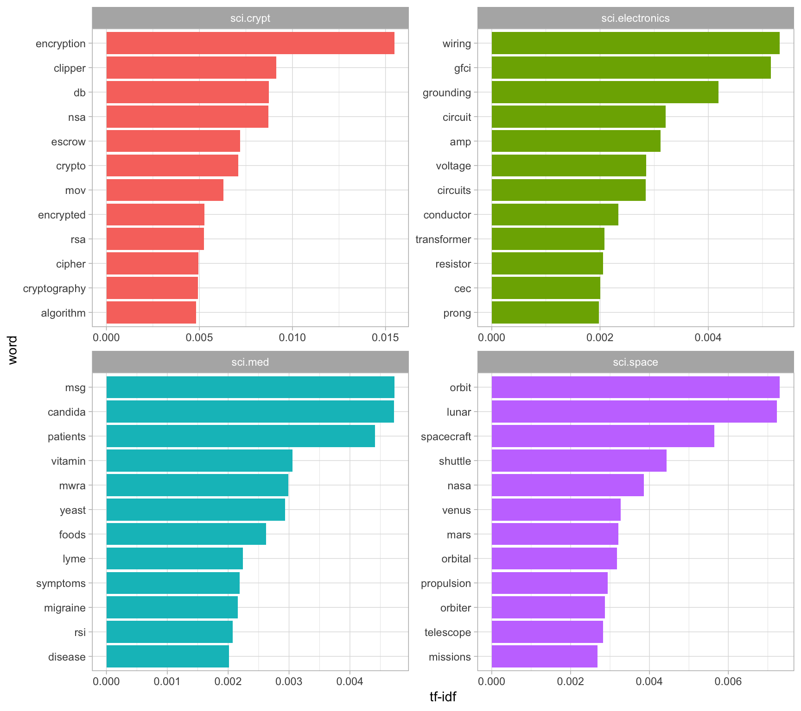

# 9 Case study: analyzing usenet text

In our final chapter, we’ll use what we’ve learned in this book to
perform a start-to-finish analysis of a set of 20,000 messages sent to
20 Usenet bulletin boards in 1993. The Usenet bulletin boards in this
dataset include newsgroups for topics like politics, religion, cars,
sports, and cryptography, and offer a rich set of text written by many
users. This data set is publicly available at
<http://qwone.com/~jason/20Newsgroups/> (the `20news-bydate.tar.gz`
file) and has become popular for exercises in text analysis and machine
learning.

## 9.1 Pre-processing

We’ll start by reading in all the messages from the `20news-bydate`
folder, which are organized in sub-folders with one file for each
message. We can read in files like these with a combination of
`read_lines()`, `map()` and `unnest()`.

> Note that this step may take several minutes to read all the
> documents.

``` r
library(dplyr)
library(tidyr)
library(purrr)
library(readr)
```

``` r
training_folder <- "data/20news-bydate/20news-bydate-train/"

# Define a function to read all files from a folder into a data frame
read_folder <- function(infolder) {
  data_frame(file = dir(infolder, full.names = TRUE)) %>%
      # dir() returns a character vector of file/dir names in a dir
    mutate(text = map(file, read_lines)) %>%
      # read_lines() returns a character vector
    transmute(id = basename(file), text) %>%
      # transmute() vs. mutate(): drops existing variables
    unnest(text)
}

# Use unnest() and map() to apply read_folder to each subfolder
raw_text <- data_frame(folder = dir(training_folder, full.names = TRUE)) %>%
  unnest(map(folder, read_folder)) %>%
  transmute(newsgroup = basename(folder), id, text)
```

``` r
raw_text
```

    ## # A tibble: 511,655 x 3
    ##    newsgroup   id    text                                                              
    ##    <chr>       <chr> <chr>                                                             
    ##  1 alt.atheism 49960 From: mathew <mathew@mantis.co.uk>                                
    ##  2 alt.atheism 49960 Subject: Alt.Atheism FAQ: Atheist Resources                       
    ##  3 alt.atheism 49960 Summary: Books, addresses, music -- anything related to atheism   
    ##  4 alt.atheism 49960 Keywords: FAQ, atheism, books, music, fiction, addresses, contacts
    ##  5 alt.atheism 49960 Expires: Thu, 29 Apr 1993 11:57:19 GMT                            
    ##  6 alt.atheism 49960 Distribution: world                                               
    ##  7 alt.atheism 49960 Organization: Mantis Consultants, Cambridge. UK.                  
    ##  8 alt.atheism 49960 Supersedes: <19930301143317@mantis.co.uk>                         
    ##  9 alt.atheism 49960 Lines: 290                                                        
    ## 10 alt.atheism 49960 ""                                                                
    ## # … with 511,645 more rows

Notice the `newsgroup` column, which describes which of the 20
newsgroups each message comes from, and `id` column, which identifies a
unique message within that newsgroup. What newsgroups are included, and
how many messages were posted in each (Figure 9.1)?

``` r
library(ggplot2)

raw_text %>%
  group_by(newsgroup) %>%
  summarize(messages = n_distinct(id)) %>%
  ggplot(aes(newsgroup, messages)) +
  geom_col() +
  coord_flip()
```


(Figure 9.1: Number of messages from each newsgroup)

We can see that Usenet newsgroup names are named hierarchically,
starting with a main topic such as “talk”, “sci”, or “rec”, followed by
further specifications.

### 9.1.1 Pre-processing text

Most of the datasets we’ve examined in this book were pre-processed,
meaning we didn’t have to remove, for example, copyright notices from
the Jane Austen novels. Here, however, each message has some structure
and extra text that we don’t want to include in our analysis. For
example, every message has a header, containing field such as “from:” or
“in\_reply\_to:” that describe the message. Some also have automated
email signatures, which occur after a line like `--`.

This kind of pre-processing can be done within the dplyr package, using
a combination of `cumsum()` (cumulative sum) and `str_detect()` from
stringr.

``` r
library(stringr)

# must occur after the first occurrence of an empty line,
# and before the first occurrence of a line starting with --
cleaned_text <- raw_text %>%
  group_by(newsgroup, id) %>%
  filter(cumsum(text == "") > 0,
         cumsum(str_detect(text, "^--")) == 0) %>%
           # ^: match at the beginning of a line
  ungroup()
```

Many lines also have nested text representing quotes from other users,
typically starting with a line like “so-and-so writes…” These can be
removed with a few regular expressions.

> We also choose to manually remove two messages, `9704` and `9985` that
> contained a large amount of non-text content.

``` r
cleaned_text <- cleaned_text %>%
  filter(str_detect(text, "^[^>]+[A-Za-z\\d]") | text == "",
         !str_detect(text, "writes(:|\\.\\.\\.)$"),
         !str_detect(text, "^In article <"),
         !id %in% c(9704, 9985))
```

At that point, we’re ready to use `unnest_tokens()` to split the dataset
into tokens, while removing stop-words.

``` r
library(tidytext)

usenet_words <- cleaned_text %>%
  unnest_tokens(word, text) %>%
  filter(str_detect(word, "[a-z']$"),
         !word %in% stop_words$word)
```

Every raw text dataset will require different steps for data cleaning,
which will often involve some trial-and-error and exploration of unusual
cases in the dataset. It’s important to notice that this cleaning can be
achieved using tidy tools such as dplyr and tidyr.

## 9.2 Words in newsgroups

Now that we’ve removed the headers, signatures, and formatting, we can
start exploring common words. For starters, we could find the most
common words in the entire dataset, or within particular newsgroups.

``` r
usenet_words %>%
  count(word, sort = TRUE)

words_by_newsgroup <- usenet_words %>%
  count(newsgroup, word, sort = TRUE) %>%
  ungroup()

words_by_newsgroup
```

    ## # A tibble: 68,137 x 2
    ##    word            n
    ##    <chr>       <int>
    ##  1 people       3655
    ##  2 time         2705
    ##  3 god          1626
    ##  4 system       1595
    ##  5 program      1103
    ##  6 bit          1097
    ##  7 information  1094
    ##  8 windows      1088
    ##  9 government   1084
    ## 10 space        1072
    ## # … with 68,127 more rows
    ## # A tibble: 173,913 x 3
    ##    newsgroup               word          n
    ##    <chr>                   <chr>     <int>
    ##  1 soc.religion.christian  god         917
    ##  2 sci.space               space       840
    ##  3 talk.politics.mideast   people      728
    ##  4 sci.crypt               key         704
    ##  5 comp.os.ms-windows.misc windows     625
    ##  6 talk.politics.mideast   armenian    582
    ##  7 sci.crypt               db          549
    ##  8 talk.politics.mideast   turkish     514
    ##  9 rec.autos               car         509
    ## 10 talk.politics.mideast   armenians   509
    ## # … with 173,903 more rows

### 9.2.1 Finding tf-idf within newsgroups

We’d expect the newsgroups to differ in terms of topic and content, and
therefore for the frequency of words to differ between them. Let’s try
quantifying this using the tf-idf metric (Chapter 3).

``` r
tf_idf <- words_by_newsgroup %>%
  bind_tf_idf(word, newsgroup, n) %>%
  arrange(desc(tf_idf))

tf_idf
```

    ## # A tibble: 173,913 x 6
    ##    newsgroup                word               n      tf   idf tf_idf
    ##    <chr>                    <chr>          <int>   <dbl> <dbl>  <dbl>
    ##  1 comp.sys.ibm.pc.hardware scsi             483 0.0176   1.20 0.0212
    ##  2 talk.politics.mideast    armenian         582 0.00805  2.30 0.0185
    ##  3 rec.motorcycles          bike             324 0.0139   1.20 0.0167
    ##  4 talk.politics.mideast    armenians        509 0.00704  2.30 0.0162
    ##  5 sci.crypt                encryption       410 0.00816  1.90 0.0155
    ##  6 rec.sport.hockey         nhl              157 0.00440  3.00 0.0132
    ##  7 talk.politics.misc       stephanopoulos   158 0.00416  3.00 0.0125
    ##  8 rec.motorcycles          bikes             97 0.00416  3.00 0.0125
    ##  9 rec.sport.hockey         hockey           270 0.00756  1.61 0.0122
    ## 10 comp.windows.x           oname            136 0.00354  3.00 0.0106
    ## # … with 173,903 more rows

We can examine the top tf-idf for a few selected groups to extract words
specific to those topics. For example, we could look at all the `sci.`
boards, visualized in Figure 9.2.

``` r
tf_idf %>%
  filter(str_detect(newsgroup, "^sci\\.")) %>%
  group_by(newsgroup) %>%
  top_n(12, tf_idf) %>%
  ungroup() %>%
  mutate(word = reorder(word, tf_idf)) %>%
  ggplot(aes(word, tf_idf, fill = newsgroup)) +
  geom_col(show.legend = FALSE) +
  facet_wrap(~ newsgroup, scales = "free") +
  ylab("tf-idf") +
  coord_flip()
```



(Figure 9.2: The 12 terms with the highest tf-idf within each of the
science-related newsgroups)

We see lots of characteristic words specific to a particular newsgroup,
such as “wiring” and “circuit” on the sci.electronics topic and “orbit”
and “lunar” for the space newsgroup. You could use this same code to
explore other newsgroups yourself.

``` r
plot_tf_idf <- function(d) {
  d %>%
    group_by(newsgroup) %>%
    top_n(10, tf_idf) %>%
    ungroup() %>%
    mutate(word = reorder(word, tf_idf)) %>%
    ggplot(aes(word, tf_idf, fill = newsgroup)) +
    geom_col(show.legend = FALSE) +
    facet_wrap(~ newsgroup, scales = "free") +
    ylab("tf-idf") +
    coord_flip()
}

tf_idf %>%
  filter(str_detect(newsgroup, "^rec\\.")) %>%
  plot_tf_idf()
```


What newsgroups tended to be similar to each other in text content? We
could discover this by finding the pairwise correlation of word
frequencies within each newsgroup, using the `pairwise_cor()` function
from the widyr package (see Chapter 4.2.2).

``` r
library(widyr)

newsgroup_cors <- words_by_newsgroup %>%
  pairwise_cor(newsgroup, word, n, sort = TRUE)
  # pairwise_cor(item, feature, value)

newsgroup_cors
```

    ## # A tibble: 380 x 3
    ##    item1                    item2                    correlation
    ##    <chr>                    <chr>                          <dbl>
    ##  1 talk.religion.misc       soc.religion.christian         0.835
    ##  2 soc.religion.christian   talk.religion.misc             0.835
    ##  3 alt.atheism              talk.religion.misc             0.779
    ##  4 talk.religion.misc       alt.atheism                    0.779
    ##  5 alt.atheism              soc.religion.christian         0.751
    ##  6 soc.religion.christian   alt.atheism                    0.751
    ##  7 comp.sys.mac.hardware    comp.sys.ibm.pc.hardware       0.680
    ##  8 comp.sys.ibm.pc.hardware comp.sys.mac.hardware          0.680
    ##  9 rec.sport.baseball       rec.sport.hockey               0.577
    ## 10 rec.sport.hockey         rec.sport.baseball             0.577
    ## # … with 370 more rows

We could then filter for stronger correlations among newsgroups, and
visualize them in a network (Figure 9.3).

``` r
library(ggraph)
library(igraph)
set.seed(2017)

newsgroup_cors %>%
  filter(correlation > .4) %>%
  graph_from_data_frame() %>%
  ggraph(layout = "fr") +
  geom_edge_link(aes(alpha = correlation, width = correlation), color = "pink") +
  geom_node_point(size = 6, color = "lightblue") +
  geom_node_text(aes(label = name), repel = TRUE) +
  theme_void()
```


(Figure 9.3: A network of Usenet groups based on the correlation of word
counts between them, including only connections with a correlation
greater than .4)

It looks like there were four main clusters of newsgroups:
computers/electronics, politics/religion, motor vehicles, and sports.
This certainly makes sense in terms of what words and topics we’d expect
these newsgroups to have in common.

### 9.2.2 Topic modeling

In Chapter 6, we used the latent Dirichlet allocation (LDA) algorithm to
divide a set of chapters into the books they originally came from. Could
LDA do the same to sort out Usenet messages that came from different
newsgroups?

Let’s try dividing up messages from the four science-related newsgroups.
We first process these into a document-term matrix with `cast_dtm()`
(Chapter 5.2), then fit the model with the `LDA()` function from the
topicmodels package.

``` r
# include only words that occur at least 50 times
word_sci_newsgroups <- usenet_words %>%
  filter(str_detect(newsgroup, "^sci")) %>%
  group_by(word) %>%
  mutate(word_total = n()) %>%
  ungroup() %>%
  filter(word_total > 50)

# convert into a document-term matrix
# with document names such as sci.crypt_14147
sci_dtm <- word_sci_newsgroups %>%
  unite(document, newsgroup, id) %>%
    # document <- newsgroup + "_" + id
  count(document, word) %>%
  cast_dtm(document, word, n)
```

``` r
library(topicmodels)
sci_lda <- LDA(sci_dtm, k = 4, control = list(seed = 2016))
```

What four topics did this model extract, and did they match the four
newsgroups? This approach will look familiar from Chapter 6: we
visualize each topic based on the most frequent terms within it (Figure
9.4).

``` r
sci_lda %>%
  tidy() %>%
    # returns a tibble with columns topic, term, beta
  group_by(topic) %>%
  top_n(8, beta) %>%
  ungroup() %>%
  mutate(term = reorder(term, beta)) %>%
  ggplot(aes(term, beta, fill = factor(topic))) +
  geom_col(show.legend = FALSE) +
  facet_wrap(~ topic, scales = "free_y") +
    # y axis after flipped; x axis is fixed
  coord_flip()
```


(Figure 9.4: The top 8 words from each topic fit by LDA on the
science-related newsgroups)

From the top words, we can start to suspect which topics may capture
which newsgroups. Topic 1 certainly represents the sci.space newsgroup
(thus the most common word being “space”), and topic 2 is likely drawn
from cryptography, with terms such as “key” and “encryption”. Just as we
did in Chapter 6.2.2, we can confirm this by seeing how documents from
each newsgroup have higher “gamma” for each topic (Figure 9.5).

``` r
sci_lda %>%
  tidy(matrix = "gamma") %>%
    # returns a tibble with columns document, topic, gamma
  separate(document, c("newsgroup", "id"), sep = "_") %>%
    # the complement of unite()
  mutate(newsgroup = reorder(newsgroup, gamma * topic)) %>%
    # make newsgroups in topic number order (1 -> 4)
  ggplot(aes(factor(topic), gamma)) +
  geom_boxplot() +
  facet_wrap(~ newsgroup) +
  labs(x = "Topic",
       y = "# of messages where this was the highest % topic")
```


(Figure 9.5: Distribution of gamma for each topic within each Usenet
newsgroup)

Much as we saw in the literature analysis, topic modeling was able to
discover the distinct topics present in the text without needing to
consult the labels.

Notice that the division of Usenet messages wasn’t as clean as the
division of book chapters, with a substantial number of messages from
each newsgroup getting high values of “gamma” for other topics. This
isn’t surprising since many of the messages are short and could
overlap in terms of common words (for example, discussions of space
travel could include many of the same words as discussions of
electronics). This is a realistic example of how LDA might divide
documents into rough topics while still allowing a degree of overlap.

## 9.3 Sentiment analysis

We can use the sentiment analysis techniques we explored in Chapter 2 to
examine how often positive and negative words occurred in these Usenet
posts. Which newsgroups were the most positive or negative overall?

In this example we’ll use the AFINN sentiment lexicon, which provides
numeric positivity scores for each word, and visualize it with a bar
plot (Figure 9.6).

``` r
newsgroup_sentiments <- words_by_newsgroup %>%
  inner_join(get_sentiments("afinn"), by = "word") %>%
  group_by(newsgroup) %>%
  summarize(score = sum(score * n) / sum(n))

newsgroup_sentiments %>%
  mutate(newsgroup = reorder(newsgroup, score)) %>%
  ggplot(aes(newsgroup, score, fill = score > 0)) +
  geom_col(show.legend = FALSE) +
  coord_flip() +
  ylab("Average sentiment score")
```


(Figure 9.6: Average AFINN score for posts within each newsgroup)

According to this analysis, the “misc.forsale” newsgroup was the most
positive. This makes sense, since it likely included many positive
adjectives about the products that users wanted to sell\!

### 9.3.1 Sentiment analysis by word

It’s worth looking deeper to understand *why* some newsgroups ended up
more positive or negative than others. For that, we can examine the
total positive and negative contributions of each word.

``` r
contributions <- usenet_words %>%
  inner_join(get_sentiments("afinn"), by = "word") %>%
  group_by(word) %>%
  summarize(occurences = n(),
            contribution = sum(score))

contributions
```

    ## # A tibble: 1,909 x 3
    ##    word      occurences contribution
    ##    <chr>          <int>        <int>
    ##  1 abandon           13          -26
    ##  2 abandoned         19          -38
    ##  3 abandons           3           -6
    ##  4 abduction          2           -4
    ##  5 abhor              4          -12
    ##  6 abhorred           1           -3
    ##  7 abhorrent          2           -6
    ##  8 abilities         16           32
    ##  9 ability          177          354
    ## 10 aboard             8            8
    ## # … with 1,899 more rows

Which words had the most effect on sentiment scores overall (Figure
9.7)?

``` r
contributions %>%
  top_n(25, abs(contribution)) %>%
  mutate(word = reorder(word, contribution)) %>%
  ggplot(aes(word, contribution, fill = contribution > 0)) +
  geom_col(show.legend = FALSE) +
  coord_flip()
```


(Figure 9.7: Words with the greatest contributions to positive/negative
sentiment scores in the Usenet text)

These words look generally reasonable as indicators of each message’s
sentiment, but we can spot possible problems with the approach. “True”
could just as easily be a part of “not true” or a similar negative
expression, and the words “God” and “Jesus” are apparently very common
on Usenet but could easily be used in many contexts, positive or
negative.

We may also care about which words contributed the most *within each
newsgroup*, so that we can see which newsgroups might be incorrectly
estimated. We can calculate each word’s contribution to each newsgroup’s
sentiment score, and visualize the strongest contributors from a
selection of the groups (Figure 9.8).

``` r
top_sentiment_words <- words_by_newsgroup %>%
  inner_join(get_sentiments("afinn"), by = "word") %>%
  mutate(contribution = score * n / sum(n))

top_sentiment_words
```

    ## # A tibble: 13,063 x 5
    ##    newsgroup              word       n score contribution
    ##    <chr>                  <chr>  <int> <int>        <dbl>
    ##  1 soc.religion.christian god      917     1      0.0144 
    ##  2 soc.religion.christian jesus    440     1      0.00692
    ##  3 talk.politics.guns     gun      425    -1     -0.00668
    ##  4 talk.religion.misc     god      296     1      0.00465
    ##  5 alt.atheism            god      268     1      0.00421
    ##  6 soc.religion.christian faith    257     1      0.00404
    ##  7 talk.religion.misc     jesus    256     1      0.00403
    ##  8 talk.politics.mideast  killed   202    -3     -0.00953
    ##  9 talk.politics.mideast  war      187    -2     -0.00588
    ## 10 soc.religion.christian true     179     2      0.00563
    ## # … with 13,053 more rows

``` r
top_sentiment_words %>%
  filter(str_detect(newsgroup, "^(talk|alt|misc)")) %>%
  group_by(newsgroup) %>%
  top_n(12, abs(contribution)) %>%
  ungroup() %>%
  mutate(newsgroup = reorder(newsgroup, contribution),
         word = reorder(paste(word, newsgroup, sep = "__"), contribution)) %>%
  ggplot(aes(word, contribution, fill = contribution > 0)) +
  geom_col(show.legend = FALSE) +
  scale_x_discrete(labels = function(x) gsub("__.+$", "", x)) +
  facet_wrap(~ newsgroup, scales = "free") +
  coord_flip() +
  labs(x = "",
       y = "Sentiment score * # of occurrences")
```


(Figure 9.8: The 12 words that contributed the most to sentiment scores
within each of six newsgroups)

This confirms our hypothesis about the “misc.forsale” newsgroup: most of
the sentiment was driven by positive adjectives such as “excellent” and
“perfect”. We can also see how much sentiment is confounded with
topic. An atheism newsgroup is likely to discuss “god” in detail even in
a negative context, and we can see that it makes the newsgroup look more
positive. Similarly, the negative contribution of the word “gun” to the
“talk.politics.guns” group will occur even when the members are
discussing guns positively.

This helps remind us that sentiment analysis can be confounded by topic,
and that we should always examine the influential words before
interpreting it too deeply.

### 9.3.2 Sentiment analysis by message

We can also try finding the most positive and negative individual
messages, by grouping and summarizing by `id` rather than `newsgroup`.

``` r
sentiment_messages <- usenet_words %>%
  inner_join(get_sentiments("afinn"), by = "word") %>%
  group_by(newsgroup, id) %>%
  summarize(sentiment = mean(score),
            words = n()) %>%
  ungroup() %>%
  filter(words >= 5)
```

> As a simple measure to reduce the role of randomness, we filtered out
> messages that had fewer than five words that contributed to sentiment.

What were the most positive messages?

``` r
sentiment_messages %>%
  arrange(desc(sentiment))
```

    ## # A tibble: 3,554 x 4
    ##    newsgroup               id     sentiment words
    ##    <chr>                   <chr>      <dbl> <int>
    ##  1 rec.sport.hockey        53560       3.89    18
    ##  2 rec.sport.hockey        53602       3.83    30
    ##  3 rec.sport.hockey        53822       3.83     6
    ##  4 rec.sport.hockey        53645       3.23    13
    ##  5 rec.autos               102768      3.2      5
    ##  6 misc.forsale            75965       3        5
    ##  7 misc.forsale            76037       3        5
    ##  8 rec.sport.baseball      104458      3       11
    ##  9 rec.sport.hockey        53571       3        5
    ## 10 comp.os.ms-windows.misc 9620        2.86     7
    ## # … with 3,544 more rows

Let’s check this by looking at the most positive message in the whole
dataset. To assist in this we could write a short function for printing
a specified message.

``` r
print_message <- function(group, message_id) {
  result <- cleaned_text %>%
    filter(newsgroup == group, id == message_id, text != "")

  cat(result$text, sep = "\n")
}

print_message("rec.sport.hockey", 53560)
```

    ## Everybody.  Please send me your predictions for the Stanley Cup Playoffs!
    ## I want to see who people think will win.!!!!!!!
    ## Please Send them in this format, or something comparable:
    ## 1. Winner of Buffalo-Boston
    ## 2. Winner of Montreal-Quebec
    ## 3. Winner of Pittsburgh-New York
    ## 4. Winner of New Jersey-Washington
    ## 5. Winner of Chicago-(Minnesota/St.Louis)
    ## 6. Winner of Toronto-Detroit
    ## 7. Winner of Vancouver-Winnipeg
    ## 8. Winner of Calgary-Los Angeles
    ## 9. Winner of Adams Division (1-2 above)
    ## 10. Winner of Patrick Division (3-4 above)
    ## 11. Winner of Norris Division (5-6 above)
    ## 12. Winner of Smythe Division (7-8 above)
    ## 13. Winner of Wales Conference (9-10 above)
    ## 14. Winner of Campbell Conference (11-12 above)
    ## 15. Winner of Stanley Cup (13-14 above)
    ## I will summarize the predictions, and see who is the biggest
    ## INTERNET GURU PREDICTING GUY/GAL.
    ## Send entries to Richard Madison
    ## rrmadiso@napier.uwaterloo.ca
    ## PS:  I will send my entries to one of you folks so you know when I say
    ## I won, that I won!!!!!

It looks like this message was chosen because it uses the word “winner”
many times. How about the most negative message? Turns out it’s also
from the hockey site, but has a very different attitude.

``` r
sentiment_messages %>%
  arrange(sentiment)

print_message("rec.sport.hockey", 53907)
```

    ## # A tibble: 3,554 x 4
    ##    newsgroup             id     sentiment words
    ##    <chr>                 <chr>      <dbl> <int>
    ##  1 rec.sport.hockey      53907      -3        6
    ##  2 sci.electronics       53899      -3        5
    ##  3 talk.politics.mideast 75918      -3        7
    ##  4 rec.autos             101627     -2.83     6
    ##  5 comp.graphics         37948      -2.8      5
    ##  6 comp.windows.x        67204      -2.7     10
    ##  7 talk.politics.guns    53362      -2.67     6
    ##  8 alt.atheism           51309      -2.6      5
    ##  9 comp.sys.mac.hardware 51513      -2.6      5
    ## 10 rec.autos             102883     -2.6      5
    ## # … with 3,544 more rows
    ## Losers like us? You are the fucking moron who has never heard of the Western
    ## Business School, or the University of Western Ontario for that matter. Why 
    ## don't you pull your head out of your asshole and smell something other than
    ## shit for once so you can look on a map to see where UWO is! Back to hockey,
    ## the North Stars should be moved because for the past few years they have
    ## just been SHIT. A real team like Toronto would never be moved!!!
    ## Andrew--

Well, we can confidently say that the sentiment analysis worked\!

### 9.3.3 N-gram analysis

In Chapter 4, we considered the effect of words such as “not” and “no”
on sentiment analysis of Jane Austen novels, such as considering whether
a phrase like “don’t like” led to passages incorrectly being labeled as
positive. The Usenet dataset is a much larger corpus of more modern
text, so we may be interested in how sentiment analysis may be reversed
in this text.

We’d start by finding and counting all the bigrams in the Usenet posts.

``` r
usenet_bigrams <- cleaned_text %>%
  unnest_tokens(bigram, text, token = "ngrams", n = 2)
```

``` r
usenet_bigram_counts <- usenet_bigrams %>%
  count(newsgroup, bigram, sort = TRUE) %>%
  ungroup() %>%
  separate(bigram, c("word1", "word2"), sep = " ")
```

We could then define a list of six words that we suspect are used in
negation, such as “no”, “not”, and “without”, and visualize the
sentiment-associated words that most often followed them (Figure 9.9).
This shows the words that most often contributed in the “wrong”
direction.

``` r
negate_words <- c("not", "without", "no", "can't", "don't", "won't")

usenet_bigram_counts %>%
  filter(word1 %in% negate_words) %>%
  count(word1, word2, wt = n, sort = TRUE, name = "nn") %>%
  inner_join(get_sentiments("afinn"), by = c(word2 = "word")) %>%
  mutate(contribution = score * nn) %>%
  group_by(word1) %>%
  top_n(10, abs(contribution)) %>%
  ungroup() %>%
  mutate(word2 = reorder(paste(word2, word1, sep = "__"), contribution)) %>%
  ggplot(aes(word2, contribution, fill = contribution > 0)) +
  geom_col(show.legend = FALSE) +
  facet_wrap(~ word1, scales = "free", nrow = 3) +
  scale_x_discrete(labels = function(x) gsub("__.+$", "", x)) +
  xlab("Words preceded by a negation") +
  ylab("Sentiment score * # of occurrences") +
  #theme(axis.text.x = element_text(angle = 90, hjust = 1)) +
  coord_flip()
```


(Figure 9.9: Words that contributed the most to sentiment when they
followed a ‘negating’ word)

It looks like the largest sources of misidentifying a word as positive
come from “don’t want/like/care”, and the largest source of incorrectly
classified negative sentiment is “no problem”.

## 9.4 Summary

In this analysis of Usenet messages, we’ve incorporated almost every
method for tidy text mining described in this book, ranging from tf-idf
to topic modeling and from sentiment analysis to n-gram tokenization.
Throughout the chapter, and indeed through all of our case studies,
we’ve been able to rely on a small list of common tools for
exploration and visualization. We hope that these examples show how much
all tidy text analyses have in common with each other, and indeed with
all tidy data analyses.
